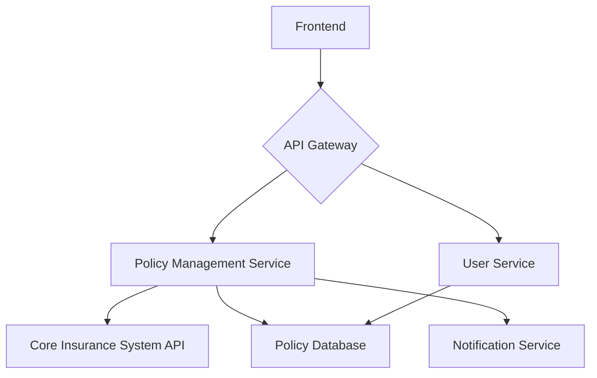

# Health Insurance Management Portal

This project is a full-stack application that allows policyholders to manage their health insurance policies. Users can view their current policy, update their policy details, and cancel their policy.

## Application Architecture

- **Backend:** FastAPI
- **Frontend:** React (Vite)
- **Database:** SQLite (for local development), PostgreSQL (recommended for production)

### High-Level Diagram



## Project Structure

```
.
├── backend
│   ├── app
│   │   ├── api
│   │   │   └── policy.py
│   │   ├── core
│   │   │   └── config.py
│   │   ├── models
│   │   │   └── policy.py
│   │   ├── schemas
│   │   │   └── policy.py
│   │   ├── database.py
│   │   └── main.py
│   ├── requirements.txt
│   └── tests
│       ├── conftest.py
│       └── test_policy.py
└── frontend
    ├── public
    ├── src
    │   ├── components
    │   │   ├── CancelPolicy.jsx
    │   │   ├── Header.jsx
    │   │   ├── PolicyDetails.jsx
    │   │   ├── QuickStats.jsx
    │   │   └── UpdatePolicy.jsx
    │   ├── pages
    │   │   └── PolicyManagement.jsx
    │   ├── services
    │   │   └── api.js
    │   ├── App.jsx
    │   ├── index.css
    │   └── main.jsx
    ├── index.html
    ├── package.json
    ├── postcss.config.js
    ├── tailwind.config.js
    └── vite.config.js
```

## Prerequisites

- Python 3.10+
- Node.js 18+
- npm
- git

## Setup Instructions

### Backend

1.  Navigate to the `backend` directory.
2.  Create a virtual environment: `python -m venv venv`
3.  Activate the virtual environment: `source venv/bin/activate`
4.  Install dependencies: `pip install -r requirements.txt`
5.  Run the application: `uvicorn app.main:app --reload`

### Frontend

1.  Navigate to the `frontend` directory.
2.  Install dependencies: `npm install`
3.  Run the application: `npm run dev`

## API Documentation

- **GET /api/v1/policyholders/{policyholder_id}**: Get policyholder details.
- **GET /api/v1/policies/{policy_id}**: Get policy details.
- **PUT /api/v1/policies/{policy_id}**: Update policy details.
- **POST /api/v1/policies/{policy_id}/cancel**: Cancel a policy.

## Running Tests

### Backend

1.  Navigate to the `backend` directory.
2.  Run tests: `pytest`

### Frontend

1.  Navigate to the `frontend` directory.
2.  Run tests: `npm test`
