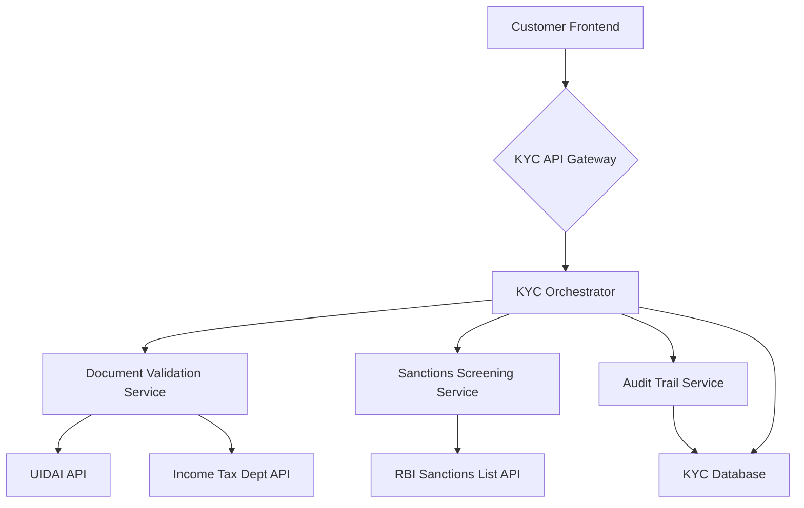

# KYC Onboarding Microservice

This project is a KYC onboarding microservice for a retail bank. It accepts Aadhaar and PAN card details, validates document authenticity, screens the customer against RBI sanctions lists, and returns an APPROVED or FLAGGED status with a full audit trail.

## Application Architecture

The application is built using a microservices architecture with a FastAPI backend and a React frontend.

- **Backend**: FastAPI, SQLAlchemy, Pydantic, PostgreSQL
- **Frontend**: React, Vite, Tailwind CSS

### High-Level Diagram



## Project Structure

```
.
├── backend
│   ├── app
│   │   ├── api
│   │   │   └── kyc.py
│   │   ├── core
│   │   │   └── config.py
│   │   ├── db
│   │   │   └── database.py
│   │   ├── models
│   │   │   └── kyc.py
│   │   ├── schemas
│   │   │   └── kyc.py
│   │   ├── services
│   │   │   └── kyc_service.py
│   │   └── main.py
│   ├── tests
│   │   ├── __init__.py
│   │   ├── conftest.py
│   │   └── test_kyc.py
│   └── requirements.txt
└── frontend
    ├── src
    │   ├── components
    │   │   ├── KycForm.jsx
    │   │   └── KycForm.test.jsx
    │   ├── test
    │   │   └── setup.js
    │   ├── App.jsx
    │   ├── index.css
    │   └── main.jsx
    ├── index.html
    ├── package.json
    ├── postcss.config.js
    ├── tailwind.config.js
    └── vite.config.js
```

## Prerequisites

- Python 3.10+
- Node.js 18+
- npm
- git

## Setup Instructions

### Backend

1.  Clone the repository.
2.  Navigate to the `backend` directory.
3.  Create a virtual environment: `python -m venv venv`
4.  Activate the virtual environment: `source venv/bin/activate`
5.  Install the dependencies: `pip install -r requirements.txt`
6.  Run the application: `uvicorn app.main:app --reload`

### Frontend

1.  Navigate to the `frontend` directory.
2.  Install the dependencies: `npm install`
3.  Run the application: `npm run dev`

## API Documentation

- **POST /api/v1/kyc/**: Create a new KYC record.
- **GET /api/v1/kyc/{kyc_id}/status**: Get the status of a KYC record.
- **GET /api/v1/kyc/{kyc_id}/audit**: Get the audit trail for a KYC record.

## Running Tests

### Backend

```bash
cd backend
pytest
```

### Frontend

```bash
npm test
```
