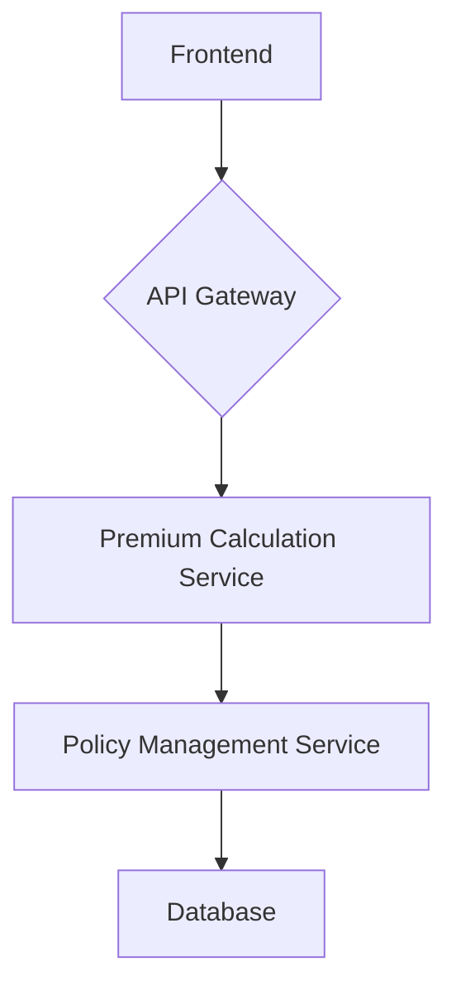

# Vehicle Insurance Premium Calculator

This project is a full-stack application that calculates vehicle insurance premiums based on a base rate, No Claims Bonus (NCB) discount, and a vehicle multiplier.

## Application Architecture

- **Tech Stack**: FastAPI (Python) for the backend, React (Vite) for the frontend, and a PostgreSQL database.
- **High-level component diagram**:



- **Communication**: The frontend communicates with the backend via a RESTful API. The backend exposes an endpoint at `/api/calculate-premium`.
- **Database Schema**: The database stores information about policies, drivers, vehicles, and NCB history.

## Project Structure

```
.
├── backend
│   ├── app
│   │   ├── api
│   │   ├── core
│   │   ├── db
│   │   ├── models
│   │   ├── schemas
│   │   └── services
│   ├── tests
│   └── requirements.txt
└── frontend
    ├── src
    │   ├── components
    │   ├── services
    │   └── ...
    ├── index.html
    └── package.json
```

## Prerequisites

- Python 3.10+
- Node.js 18+
- npm
- git

## Setup Instructions

1.  **Clone the repo**
2.  **Backend Setup**:
    -   `cd backend`
    -   `python -m venv venv`
    -   `source venv/bin/activate`
    -   `pip install -r requirements.txt`
    -   `uvicorn app.main:app --reload`
3.  **Frontend Setup**:
    -   `cd frontend`
    -   `npm install`
    -   `npm run dev`

## API Documentation

- **Endpoint**: `POST /api/calculate-premium`
- **Request Body**:

```json
{
  "baseRate": 500,
  "claimFreeYears": 3,
  "vehicleMultiplier": 1.2
}
```

- **Response**:

```json
{
  "premium": 390
}
```

## Running Tests

- **Backend**: `cd backend && pytest`
- **Frontend**: `cd frontend && npm test`
