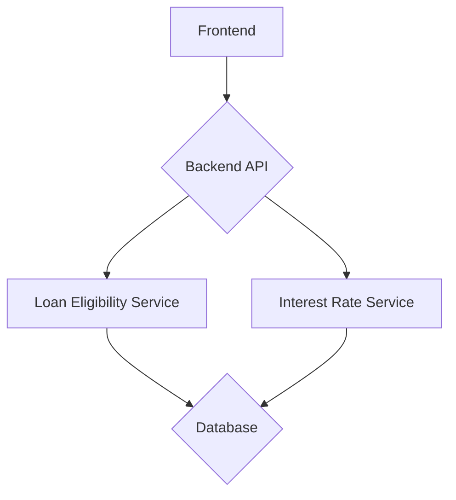

# Loan Eligibility Decision System

This project is a loan eligibility decision system that determines if a user is eligible for a loan and at what interest rate based on their financial details.

## Application Architecture

The application follows a full-stack architecture with a React frontend and a FastAPI backend.

- **Frontend**: React (Vite), Tailwind CSS
- **Backend**: FastAPI, Python
- **Database**: PostgreSQL (production), SQLite (testing)

### High-Level Diagram



## Project Structure

```
.
├── backend
│   ├── app
│   │   ├── api
│   │   ├── core
│   │   ├── db
│   │   ├── models
│   │   ├── schemas
│   │   └── services
│   ├── tests
│   └── requirements.txt
└── frontend
    ├── public
    ├── src
    │   ├── components
    │   └── services
    ├── package.json
    └── vite.config.js
```

## Prerequisites

- Python 3.10+
- Node.js 18+
- npm
- git

## Setup Instructions

### Backend

1.  Navigate to the `backend` directory.
2.  Create a virtual environment: `python -m venv venv`
3.  Activate the virtual environment: `source venv/bin/activate`
4.  Install dependencies: `pip install -r requirements.txt`
5.  Create a `.env` file with the `DATABASE_URL`.
6.  Run the application: `uvicorn app.main:app --reload`

### Frontend

1.  Navigate to the `frontend` directory.
2.  Install dependencies: `npm install`
3.  Run the development server: `npm run dev`

## API Documentation

### POST /api/v1/loan/check-eligibility

Checks the loan eligibility for a user.

**Request Body:**

```json
{
  "credit_score": 750,
  "annual_income": 100000,
  "monthly_debts": 1000
}
```

**Response:**

```json
{
  "applicant_id": "some-uuid",
  "eligibility_status": true,
  "interest_rate": 4.25,
  "ineligibility_reasons": null
}
```

## Running Tests

### Backend

Navigate to the `backend` directory and run:

```bash
pytest
```
