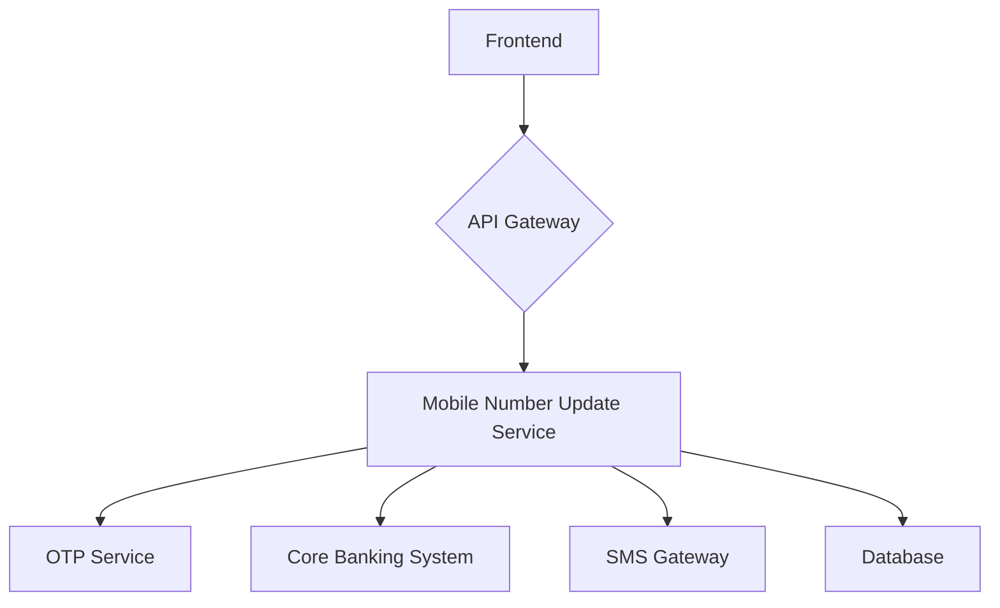

# Mobile Number Update Service

This project is a full-stack application that allows bank customers to securely update their registered mobile number.

## Application Architecture

- **Tech Stack**: FastAPI (Python) for the backend, React (Vite) for the frontend, and PostgreSQL for the database.
- **High-level component diagram**:



- **Frontend-Backend Communication**: The frontend communicates with the backend via a RESTful API. The backend runs on port 8000.
- **Database Schema**: The database consists of two tables: `customers` and `otps`.

## Project Structure

```
.
├── backend
│   ├── core
│   │   ├── __init__.py
│   │   └── config.py
│   ├── database.py
│   ├── __init__.py
│   ├── main.py
│   ├── models
│   │   ├── __init__.py
│   │   └── models.py
│   ├── routers
│   │   ├── __init__.py
│   │   └── mobile_update.py
│   ├── schemas
│   │   ├── __init__.py
│   │   └── schemas.py
│   ├── services
│   │   ├── __init__.py
│   │   └── mobile_update_service.py
│   └── tests
│       ├── __init__.py
│       └── test_mobile_update.py
└── frontend
    ├── index.html
    ├── package.json
    ├── postcss.config.js
    ├── src
    │   ├── App.css
    │   ├── App.jsx
    │   ├── App.test.jsx
    │   ├── index.css
    │   ├── main.jsx
    │   └── setupTests.js
    ├── tailwind.config.js
    └── vite.config.js
```

## Prerequisites

- Python 3.10+
- Node.js 18+
- npm
- git

## Setup Instructions

### Backend

1.  Navigate to the `backend` directory.
2.  Create a virtual environment: `python -m venv venv`
3.  Activate the virtual environment: `source venv/bin/activate`
4.  Install the dependencies: `pip install -r requirements.txt`
5.  Run the application: `uvicorn main:app --reload`

### Frontend

1.  Navigate to the `frontend` directory.
2.  Install the dependencies: `npm install`
3.  Run the application: `npm run dev`

## API Documentation

- **POST /mobile-update/initiate**: Initiates the mobile number update process.
- **POST /mobile-update/verify-old-otp**: Verifies the OTP sent to the old mobile number.
- **POST /mobile-update/verify-new-otp**: Verifies the OTP sent to the new mobile number and updates the mobile number.

## Running Tests

### Backend

```bash
cd backend
pytest
```

### Frontend

```bash
cd frontend
npm test
```
