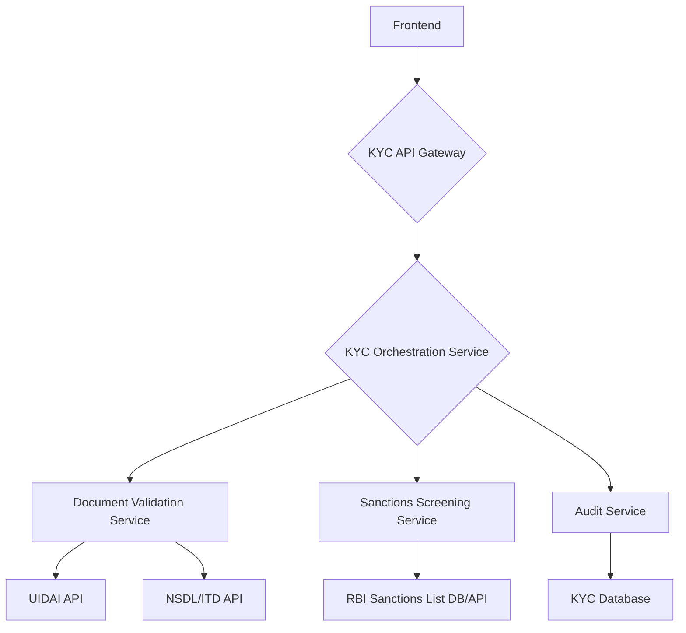

# KYC Onboarding Microservice

This project is a Know Your Customer (KYC) onboarding microservice for a retail bank. It provides a RESTful API to handle KYC requests, including Aadhaar and PAN card validation, and screening against sanction lists.

## Application Architecture

The application is built using a full-stack approach with a FastAPI backend and a React frontend.

### Tech Stack

*   **Backend**: Python, FastAPI, SQLAlchemy, PostgreSQL
*   **Frontend**: React, Vite, Tailwind CSS

### High-Level Diagram



### Database Schema

The database consists of three main tables:

*   `customers`: Stores customer information, including their KYC status.
*   `documents`: Stores information about the documents submitted by the customer, such as Aadhaar and PAN cards.
*   `audit_trails`: Records a complete audit trail of the KYC process for each customer.

## Project Structure

```
.
├── backend
│   ├── app
│   │   ├── api
│   │   │   ├── endpoints
│   │   │   │   └── kyc.py
│   │   │   └── api_router.py
│   │   ├── core
│   │   │   └── config.py
│   │   ├── database.py
│   │   ├── main.py
│   │   ├── models
│   │   │   └── kyc.py
│   │   ├── schemas
│   │   │   └── kyc.py
│   │   └── services
│   │       └── kyc_service.py
│   └── tests
│       ├── conftest.py
│       └── test_kyc.py
└── frontend
    ├── src
    │   ├── components
    │   │   ├── AadhaarInput.jsx
    │   │   ├── AuditTrail.jsx
    │   │   ├── PanInput.jsx
    │   │   ├── SideNavBar.jsx
    │   │   ├── StatusIndicator.jsx
    │   │   └── TopNavBar.jsx
    │   ├── services
    │   │   └── api.js
    │   ├── App.jsx
    │   ├── index.css
    │   └── main.jsx
    ├── index.html
    ├── package.json
    ├── postcss.config.js
    ├── tailwind.config.js
    └── vite.config.js
```

## Prerequisites

*   Python 3.10+
*   Node.js 18+
*   npm
*   git

## Setup Instructions

### Backend

1.  Navigate to the `backend` directory.
2.  Create a virtual environment: `python -m venv venv`
3.  Activate the virtual environment: `source venv/bin/activate`
4.  Install the dependencies: `pip install -r requirements.txt`
5.  Create a `.env` file and set the `DATABASE_URL` environment variable.
6.  Run the application: `uvicorn app.main:app --reload`

### Frontend

1.  Navigate to the `frontend` directory.
2.  Install the dependencies: `npm install`
3.  Run the development server: `npm run dev`

## API Documentation

### POST /api/v1/kyc

Initiates a new KYC request.

**Request Body:**

```json
{
  "full_name": "John Doe",
  "aadhaar_number": "123456789012",
  "pan_number": "ABCDE1234F"
}
```

**Response:**

```json
{
  "customer_id": "some-uuid",
  "status": "APPROVED",
  "message": "KYC process completed successfully."
}
```

## Running Tests

### Backend

Navigate to the `backend` directory and run:

```bash
pytest
```

### Frontend

Navigate to the `frontend` directory and run:

```bash
npm test
```
