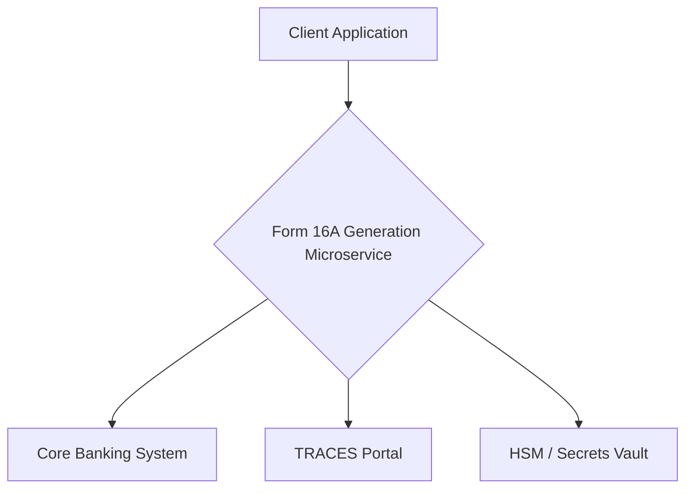

# Form 16A Generation Microservice

This microservice generates digitally signed Form 16A certificates for customers of a retail bank.

## Application Architecture

- **Tech Stack**: FastAPI, Python
- **High-level component diagram**:



- **Communication**: The frontend and backend communicate via a RESTful API. The main endpoint is `POST /api/v1/form16a/generate`.
- **Database Schema**: This microservice is stateless and does not have its own database.

## Project Structure

```
.
├── backend
│   ├── app
│   │   ├── api
│   │   │   └── form16a.py
│   │   ├── core
│   │   │   └── config.py
│   │   ├── models
│   │   ├── schemas
│   │   │   └── form16a.py
│   │   ├── services
│   │   │   ├── cbs_service.py
│   │   │   ├── digital_signature_service.py
│   │   │   ├── pdf_service.py
│   │   │   └── traces_service.py
│   │   └── main.py
│   ├── requirements.txt
│   └── tests
│       ├── conftest.py
│       ├── test_main.py
│       └── test_form16a.py
└── README.md
```

## Prerequisites

- Python 3.10+
- pip
- git

## Setup Instructions

1.  **Clone the repo**:
    ```bash
    git clone https://github.com/p67428378-afk/test2.git
    cd test2
    ```

2.  **Backend setup**:
    ```bash
    cd backend
    python -m venv venv
    source venv/bin/activate  # On Windows use `venv\Scripts\activate`
    pip install -r requirements.txt
    uvicorn app.main:app --reload
    ```

## API Documentation

**Endpoint**: `POST /api/v1/form16a/generate`

**Request Body**:

```json
{
  "customerPan": "ABCDE1234F",
  "financialYear": "2023-2024"
}
```

**Response**: A digitally signed PDF document containing the Form 16A and TDS reconciliation summary.

## Running Tests

```bash
cd backend
pytest
```
