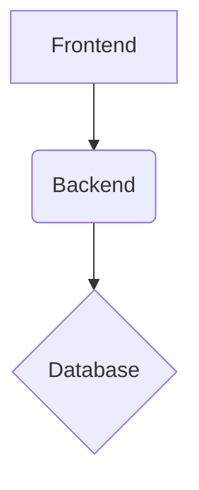

# Todo List Application

This is a simple Todo List application built with FastAPI and React.

## Application Architecture

- **Tech stack**: FastAPI, React, PostgreSQL
- **High-level component diagram**:



- **How frontend and backend communicate**: The frontend communicates with the backend via a RESTful API.
- **Database schema overview**: The database contains a single table `tasks` with the following columns:
    - `id`: Primary Key
    - `description`: String
    - `dueDate`: Date
    - `priority`: Enum (Low, Medium, High, Urgent)
    - `isComplete`: Boolean

## Project Structure

```
.
├── backend
│   ├── app
│   │   ├── api
│   │   │   └── v1
│   │   │       └── endpoints
│   │   │           └── tasks.py
│   │   ├── core
│   │   │   └── config.py
│   │   ├── db
│   │   │   └── database.py
│   │   ├── models
│   │   │   └── task.py
│   │   ├── schemas
│   │   │   └── task.py
│   │   ├── services
│   │   │   └── task_service.py
│   │   └── main.py
│   ├── requirements.txt
│   └── tests
│       ├── conftest.py
│       └── test_tasks.py
└── frontend
    ├── index.html
    ├── package.json
    ├── postcss.config.js
    ├── src
    │   ├── App.jsx
    │   ├── App.test.jsx
    │   ├── components
    │   │   ├── AddTask.jsx
    │   │   ├── TaskItem.jsx
    │   │   └── TaskList.jsx
    │   ├── index.css
    │   ├── main.jsx
    │   └── services
    │       └── taskService.js
    ├── tailwind.config.js
    └── vite.config.js
```

## Prerequisites

- Python 3.10+
- Node.js 18+
- npm
- git

## Setup Instructions

### Backend

1.  `cd backend`
2.  `python -m venv venv`
3.  `source venv/bin/activate`
4.  `pip install -r requirements.txt`
5.  `uvicorn app.main:app --reload`

### Frontend

1.  `cd frontend`
2.  `npm install`
3.  `npm run dev`

## API Documentation

- `POST /api/v1/tasks/`: Create a new task.
- `GET /api/v1/tasks/`: Get all tasks.
- `GET /api/v1/tasks/{task_id}`: Get a specific task.
- `PUT /api/v1/tasks/{task_id}`: Update a task.
- `PUT /api/v1/tasks/{task_id}/complete`: Mark a task as complete.
- `DELETE /api/v1/tasks/{task_id}`: Delete a task.

## Running Tests

### Backend

`cd backend && pytest`

### Frontend

`cd frontend && npm test`
