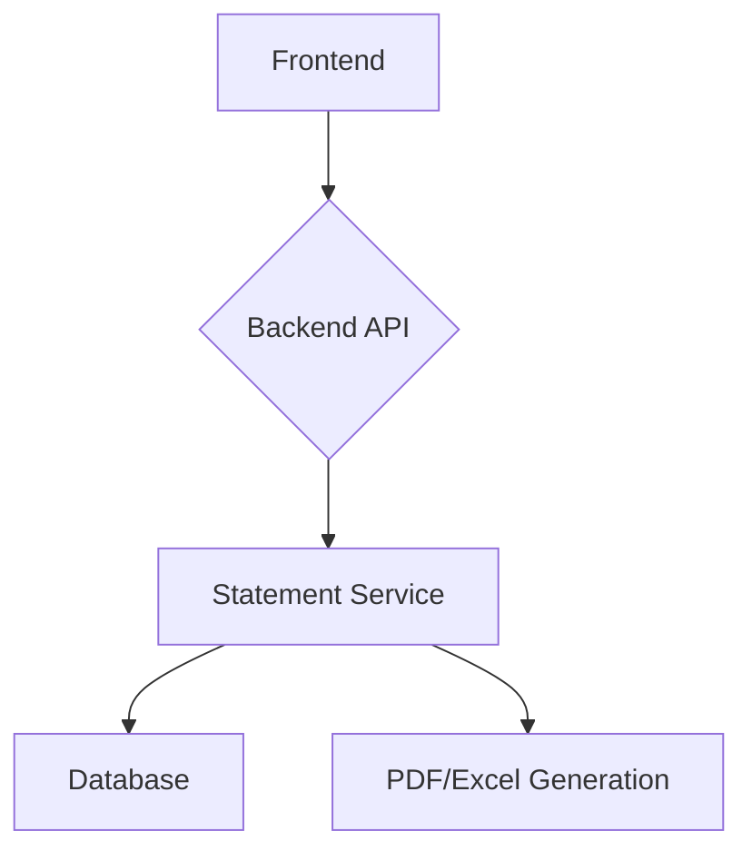

# Bank Account Statement Generation Service

This is a FastAPI and React application that allows users to generate bank account statements in PDF and Excel formats.

## Application Architecture

- **Backend**: FastAPI, SQLAlchemy, Pydantic
- **Frontend**: React, Vite, Tailwind CSS
- **Database**: SQLite (default), PostgreSQL (optional)

### High-level component diagram



## Project Structure

```
.
├── backend
│   ├── __init__.py
│   ├── database.py
│   ├── main.py
│   ├── models.py
│   ├── routers
│   │   ├── __init__.py
│   │   └── statement_router.py
│   ├── schemas.py
│   └── services
│       ├── __init__.py
│       └── statement_service.py
├── frontend
│   ├── index.html
│   ├── package.json
│   ├── postcss.config.js
│   ├── src
│   │   ├── App.jsx
│   │   ├── components
│   │   │   ├── AccountSummary.jsx
│   │   │   ├── BalanceOverview.jsx
│   │   │   ├── BottomNavBar.jsx
│   │   │   ├── ComplianceFooter.jsx
│   │   │   ├── DateRangeSelection.jsx
│   │   │   └── DownloadActions.jsx
│   │   ├── index.css
│   │   ├── main.jsx
│   │   └── services
│   │       └── api.js
│   ├── tailwind.config.js
│   └── vite.config.js
├── README.md
└── requirements.txt
```

## Prerequisites

- Python 3.10+
- Node.js 18+
- npm
- git

## Setup Instructions

### Backend

1.  Create a virtual environment:
    ```bash
    python -m venv venv
    source venv/bin/activate
    ```
2.  Install dependencies:
    ```bash
    pip install -r requirements.txt
    ```
3.  Run the application:
    ```bash
    uvicorn backend.main:app --reload
    ```

### Frontend

1.  Install dependencies:
    ```bash
    cd frontend
    npm install
    ```
2.  Run the development server:
    ```bash
    npm run dev
    ```

## API Documentation

- **POST /statements/pdf**: Generate a PDF statement.
- **POST /statements/excel**: Generate an Excel statement.

Request body for both endpoints:

```json
{
  "account_number": "string",
  "start_date": "datetime",
  "end_date": "datetime"
}
```

## Running Tests

### Backend

```bash
pytest
```
