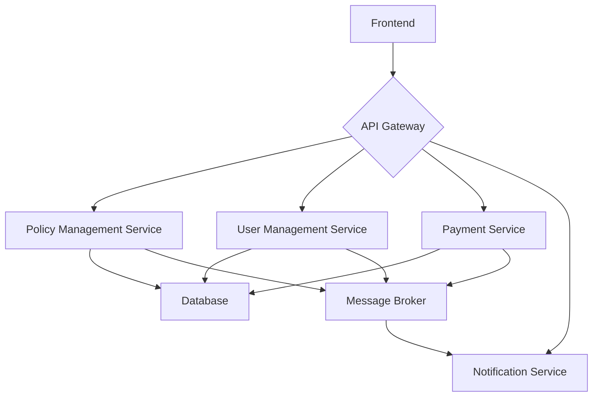

# Health Insurance Management Portal

This project is a health insurance management portal that allows policyholders to manage their health insurance policies online.

## Application Architecture

- **Tech Stack**: FastAPI, React, PostgreSQL
- **High-level component diagram**:



- **Frontend and backend communication**: The frontend communicates with the backend via a RESTful API.
- **Database schema overview**: The database schema includes tables for `PolicyHolders`, `Policies`, `CoverageDetails`, `PaymentMethods`, and `PolicyChangeRequests`.

## Project Structure

```
.
├── backend
│   ├── api
│   │   ├── __init__.py
│   │   ├── policies.py
│   │   └── policy_holders.py
│   ├── core
│   │   ├── __init__.py
│   │   └── crud.py
│   ├── models
│   │   ├── __init__.py
│   │   └── policy.py
│   ├── schemas
│   │   ├── __init__.py
│   │   └── policy.py
│   ├── tests
│   │   ├── __init__.py
│   │   ├── conftest.py
│   │   └── test_policies.py
│   ├── __init__.py
│   └── main.py
├── frontend
│   ├── src
│   │   ├── components
│   │   │   ├── ManagementSection.jsx
│   │   │   ├── SideNavBar.jsx
│   │   │   └── TopNavBar.jsx
│   │   ├── pages
│   │   │   └── PolicyOverview.jsx
│   │   ├── test
│   │   │   └── setup.js
│   │   ├── App.jsx
│   │   ├── App.test.jsx
│   │   ├── index.css
│   │   └── main.jsx
│   ├── index.html
│   ├── package.json
│   ├── postcss.config.js
│   ├── tailwind.config.js
│   └── vite.config.js
├── .gitignore
└── requirements.txt
```

## Prerequisites

- Python 3.10+
- Node.js 18+
- npm
- git

## Setup Instructions

### Backend

1.  Clone the repo
2.  Create a virtual environment: `python -m venv venv`
3.  Activate the virtual environment: `source venv/bin/activate`
4.  Install the requirements: `pip install -r requirements.txt`
5.  Run the application: `uvicorn backend.main:app --reload`

### Frontend

1.  Navigate to the `frontend` directory: `cd frontend`
2.  Install the dependencies: `npm install`
3.  Run the application: `npm run dev`

## API Documentation

- `POST /policy-holders/`: Create a new policy holder.
- `POST /policy-holders/{policy_holder_id}/policies/`: Create a new policy for a policy holder.
- `GET /policies/{policy_id}`: Get a policy by ID.
- `PUT /policies/{policy_id}`: Update a policy by ID.
- `DELETE /policies/{policy_id}`: Delete a policy by ID.

## Running Tests

### Backend

`pytest`

### Frontend

`npm test`
