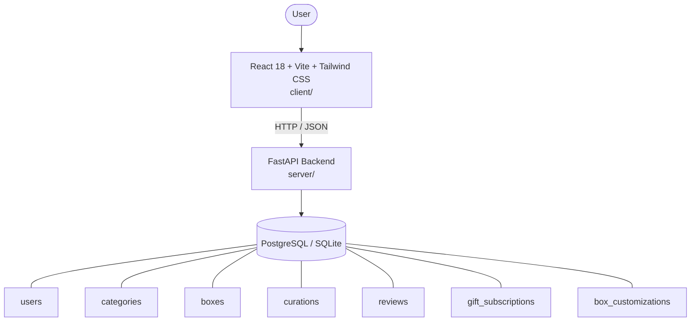

# Architecture

_Auto-generated by the SDLC Assistant from the generated codebase and the approved Feature Spec (latest: SCRUM-223). Regenerated on each push._

## System Diagram

## Tech Stack
- **language**: Python 3.10+
- **backend_framework**: FastAPI
- **orm**: SQLAlchemy 2.x
- **database**: PostgreSQL / SQLite
- **frontend**: React 18 + Vite + Tailwind CSS
- **cloud_provider**: GCP (Cloud Run / Cloud SQL)
- **constitution_section_4_followed**: True

## Backend Modules (server/)
- server/__init__.py
- server/auth.py
- server/database.py
- server/main.py
- server/models.py
- server/routers/__init__.py
- server/routers/auth.py
- server/routers/boxes.py
- server/routers/categories.py
- server/routers/reviews.py
- server/schemas.py
- server/tests/__init__.py
- server/tests/conftest.py
- server/tests/test_auth.py
- server/tests/test_boxes.py
- server/tests/test_categories.py
- server/tests/test_reviews.py

## Frontend Modules (client/)
- client/eslint.config.js
- client/postcss.config.js
- client/src/App.jsx
- client/src/components/__tests__/BoxCatalogGrid.test.jsx
- client/src/components/__tests__/WriteReviewModal.test.jsx
- client/src/components/boxes/BoxCatalogGrid.jsx
- client/src/components/boxes/CurationDetailHero.jsx
- client/src/components/boxes/CurationItemBreakdown.jsx
- client/src/components/boxes/FilterSidebar.jsx
- client/src/components/common/Header.jsx
- client/src/components/common/Navbar.jsx
- client/src/components/reviews/ReviewListAndSummary.jsx
- client/src/components/reviews/WriteReviewModal.jsx
- client/src/main.jsx
- client/src/pages/BoxCatalogPage.jsx
- client/src/pages/BoxDetailPage.jsx
- client/src/services/api.js
- client/src/setup.js
- client/tailwind.config.js
- client/vite.config.js

## API Endpoints
- GET /api/v1/boxes
- GET /api/v1/boxes/{id}
- GET /api/v1/boxes/{id}/reviews
- POST /api/v1/boxes/{id}/reviews
- POST /api/v1/boxes/{id}/gift
- GET /api/v1/boxes/{id}/customizations
- POST /api/v1/boxes/{id}/customizations

## Data Model
- users
- categories
- boxes
- curations
- reviews
- gift_subscriptions
- box_customizations
