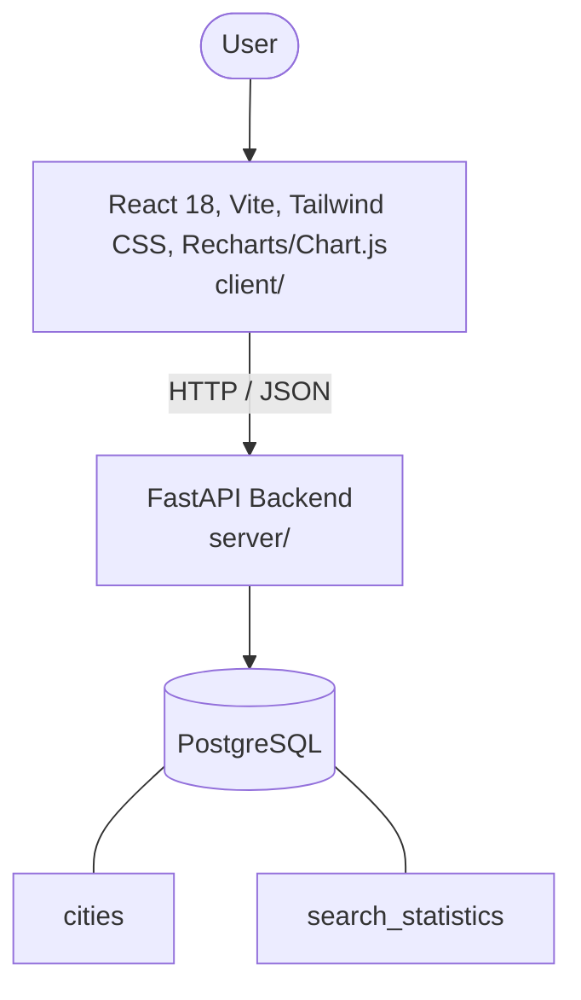

# Architecture

_Auto-generated by the SDLC Assistant from the generated codebase and the approved Feature Spec (latest: SCRUM-148). Regenerated on each push._

## System Diagram

## Tech Stack
- **language**: Python
- **backend_framework**: FastAPI
- **orm**: SQLAlchemy
- **database**: PostgreSQL
- **frontend**: React 18, Vite, Tailwind CSS, Recharts/Chart.js
- **cloud_provider**: GCP
- **constitution_section_4_followed**: True

## Backend Modules (server/)
- server/__init__.py
- server/config.py
- server/database.py
- server/main.py
- server/models.py
- server/schemas.py
- server/services.py
- server/tests/__init__.py
- server/tests/conftest.py
- server/tests/test_weather.py

## Frontend Modules (client/)
- (no client/ files found yet)

## API Endpoints
- GET /api/v1/weather/search
- GET /api/v1/weather/forecast

## Data Model
- cities
- search_statistics
