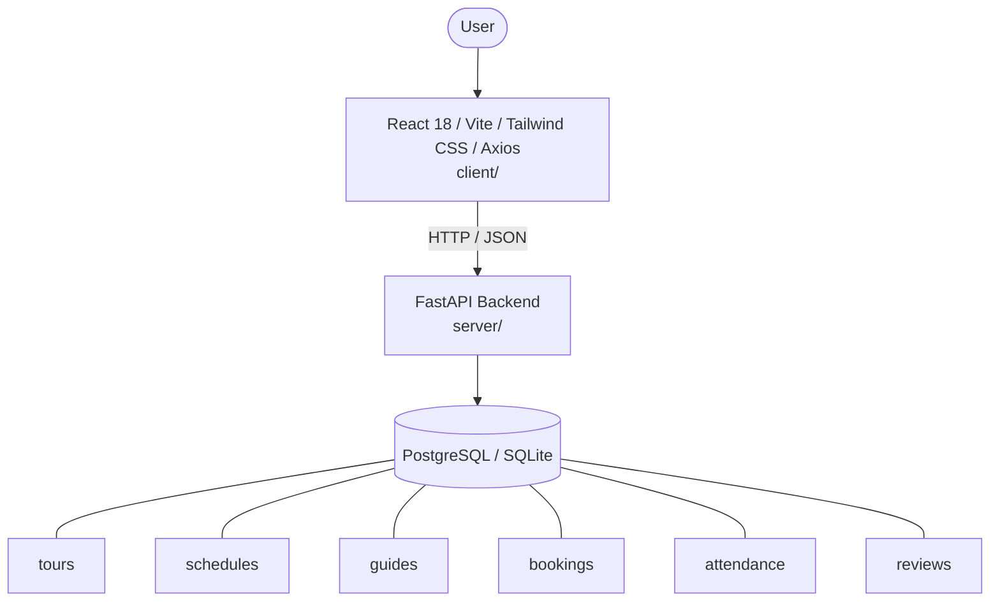

# Architecture

_Auto-generated by the SDLC Assistant from the generated codebase and the approved Feature Spec (latest: SCRUM-193). Regenerated on each push._

## System Diagram

## Tech Stack
- **language**: Python 3.11
- **backend_framework**: FastAPI
- **orm**: SQLAlchemy 2.x
- **database**: PostgreSQL / SQLite
- **frontend**: React 18 / Vite / Tailwind CSS / Axios
- **cloud_provider**: GCP Cloud Run
- **constitution_section_4_followed**: True

## Backend Modules (server/)
- server/__init__.py
- server/database.py
- server/main.py
- server/models.py
- server/routers/__init__.py
- server/routers/admin.py
- server/routers/attendance.py
- server/routers/bookings.py
- server/routers/guides.py
- server/routers/reviews.py
- server/routers/schedules.py
- server/routers/tours.py
- server/schemas.py
- server/tests/__init__.py
- server/tests/conftest.py
- server/tests/test_attendance.py
- server/tests/test_bookings.py
- server/tests/test_guides.py
- server/tests/test_reviews.py
- server/tests/test_schedules.py
- server/tests/test_tours.py

## Frontend Modules (client/)
- client/eslint.config.js
- client/postcss.config.js
- client/src/App.jsx
- client/src/App.test.jsx
- client/src/components/admin/AttendanceCheckInTable.jsx
- client/src/components/admin/GuideAssignmentModal.jsx
- client/src/components/admin/ScheduleModal.jsx
- client/src/components/admin/ScheduleTable.jsx
- client/src/components/admin/ScheduleTable.test.jsx
- client/src/components/layout/Navbar.jsx
- client/src/components/tours/TicketBookingForm.jsx
- client/src/components/tours/TourCatalog.jsx
- client/src/components/tours/TourCatalog.test.jsx
- client/src/main.jsx
- client/src/pages/AdminSchedulePage.jsx
- client/src/pages/AttendancePage.jsx
- client/src/pages/GuideManagementPage.jsx
- client/src/pages/VisitorBookingPage.jsx
- client/src/services/api.js
- client/src/services/api.test.js
- client/src/setup.js
- client/tailwind.config.js
- client/vite.config.js

## API Endpoints
- POST /api/v1/reviews
- GET /api/v1/admin/guides/{guide_id}/metrics
- GET /api/v1/admin/feedback/summary

## Data Model
- tours
- schedules
- guides
- bookings
- attendance
- reviews
