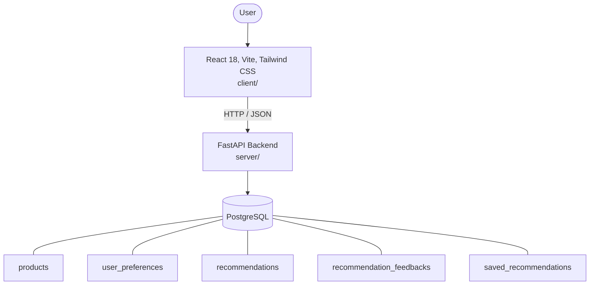

# Architecture

_Auto-generated by the SDLC Assistant from the generated codebase and the approved Feature Spec (latest: SCRUM-244). Regenerated on each push._

## System Diagram

## Tech Stack
- **language**: Python 3.11
- **backend_framework**: FastAPI
- **orm**: SQLAlchemy 2.x
- **database**: PostgreSQL
- **frontend**: React 18, Vite, Tailwind CSS
- **cloud_provider**: GCP
- **constitution_section_4_followed**: True

## Backend Modules (server/)
- server/__init__.py
- server/database.py
- server/main.py
- server/models.py
- server/routers/__init__.py
- server/routers/feedback.py
- server/routers/preferences.py
- server/routers/products.py
- server/routers/recommendations.py
- server/routers/saved_items.py
- server/schemas.py
- server/services/__init__.py
- server/services/recommendation_engine.py
- server/tests/__init__.py
- server/tests/conftest.py
- server/tests/test_feedback.py
- server/tests/test_preferences.py
- server/tests/test_products.py
- server/tests/test_recommendations.py
- server/tests/test_saved_items.py

## Frontend Modules (client/)
- client/eslint.config.js
- client/postcss.config.js
- client/src/App.jsx
- client/src/App.test.jsx
- client/src/components/FallbackBanner.jsx
- client/src/components/FallbackBanner.test.jsx
- client/src/components/FilterSidebar.jsx
- client/src/components/FilterSidebar.test.jsx
- client/src/components/Navbar.jsx
- client/src/components/Navbar.test.jsx
- client/src/components/PaginationBar.jsx
- client/src/components/PaginationBar.test.jsx
- client/src/components/PreferenceForm.jsx
- client/src/components/PreferenceForm.test.jsx
- client/src/components/ProductCard.jsx
- client/src/components/ProductCard.test.jsx
- client/src/components/RecommendationCard.jsx
- client/src/components/RecommendationCard.test.jsx
- client/src/main.jsx
- client/src/pages/CatalogPage.jsx
- client/src/pages/CatalogPage.test.jsx
- client/src/pages/PreferencesPage.jsx
- client/src/pages/PreferencesPage.test.jsx
- client/src/pages/RecommendationsPage.jsx
- client/src/pages/RecommendationsPage.test.jsx
- client/src/services/api.js
- client/src/services/api.test.js
- client/src/setup.js
- client/tailwind.config.js
- client/vite.config.js

## API Endpoints
- GET /api/v1/products
- POST /api/v1/preferences
- GET /api/v1/preferences/{user_id}
- POST /api/v1/recommendations/generate
- POST /api/v1/recommendations/feedback
- POST /api/v1/recommendations/saved
- GET /api/v1/recommendations/saved
- DELETE /api/v1/recommendations/saved/{saved_id}
- GET /api/v1/recommendations/history

## Data Model
- products
- user_preferences
- recommendations
- recommendation_feedbacks
- saved_recommendations
