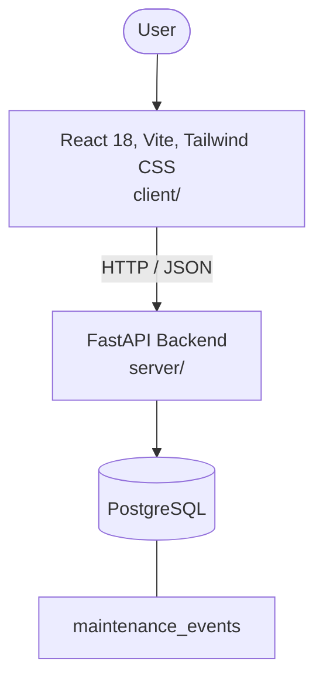

# Architecture

_Auto-generated by the SDLC Assistant from the generated codebase and the approved Feature Spec (latest: SCRUM-102). Regenerated on each push._

## System Diagram

## Tech Stack
- **language**: Python 3.11
- **backend_framework**: FastAPI
- **orm**: SQLAlchemy 2.x
- **database**: PostgreSQL
- **frontend**: React 18, Vite, Tailwind CSS
- **cloud_provider**: Google Cloud Platform (GCP Cloud Run)
- **constitution_section_4_followed**: True

## Backend Modules (server/)
- server/__init__.py
- server/database.py
- server/main.py
- server/models.py
- server/routers/__init__.py
- server/routers/maintenance_events.py
- server/schemas.py
- server/services/__init__.py
- server/services/maintenance_service.py
- server/tests/__init__.py
- server/tests/conftest.py
- server/tests/test_maintenance_events.py

## Frontend Modules (client/)
- (no client/ files found yet)

## API Endpoints
- POST /api/v1/maintenance-events
- GET /api/v1/maintenance-events
- GET /api/v1/maintenance-events/{id}
- PUT /api/v1/maintenance-events/{id}
- DELETE /api/v1/maintenance-events/{id}
- GET /api/v1/maintenance-events/summary
- GET /api/v1/maintenance-events/export

## Data Model
- maintenance_events
