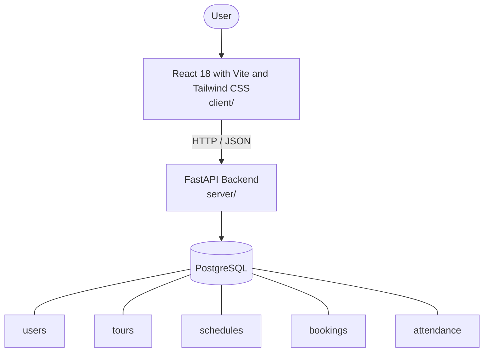

# Architecture

_Auto-generated by the SDLC Assistant from the generated codebase and the approved Feature Spec (latest: SCRUM-31). Regenerated on each push._

## System Diagram

## Tech Stack
- **language**: Python 3.11
- **backend_framework**: FastAPI
- **orm**: SQLAlchemy 2.x
- **database**: PostgreSQL
- **frontend**: React 18 with Vite and Tailwind CSS
- **cloud_provider**: GCP
- **constitution_section_4_followed**: True

## Backend Modules (server/)
- server/__init__.py
- server/auth.py
- server/database.py
- server/main.py
- server/models.py
- server/routers/__init__.py
- server/routers/attendance.py
- server/routers/auth.py
- server/routers/bookings.py
- server/routers/schedules.py
- server/routers/tours.py
- server/schemas.py
- server/tests/__init__.py
- server/tests/conftest.py
- server/tests/test_attendance.py
- server/tests/test_auth.py
- server/tests/test_bookings.py
- server/tests/test_schedules.py
- server/tests/test_tours.py

## Frontend Modules (client/)
- client/eslint.config.js
- client/postcss.config.js
- client/src/App.jsx
- client/src/App.test.jsx
- client/src/components/CertificateVerificationCard.jsx
- client/src/components/CertificateVerificationCard.test.jsx
- client/src/components/Header.jsx
- client/src/components/LiveLeaderboardTable.jsx
- client/src/components/LiveLeaderboardTable.test.jsx
- client/src/components/Modal.jsx
- client/src/components/PlayerRegistrationForm.jsx
- client/src/components/PlayerRegistrationForm.test.jsx
- client/src/components/PlayerRosterTable.jsx
- client/src/components/PlayerRosterTable.test.jsx
- client/src/components/Sidebar.jsx
- client/src/components/StatCard.jsx
- client/src/components/SwissPairingMatrix.jsx
- client/src/components/SwissPairingMatrix.test.jsx
- client/src/components/TournamentHeader.jsx
- client/src/components/TournamentHeader.test.jsx
- client/src/components/catalog/AddBookModal.jsx
- client/src/components/catalog/BookCatalogTable.jsx
- client/src/components/common/Badge.jsx
- client/src/components/common/Button.jsx
- client/src/components/common/Modal.jsx
- client/src/components/common/SearchBar.jsx
- client/src/components/dashboard/ActiveLoansTable.jsx
- client/src/components/dashboard/OverdueFinesTable.jsx
- client/src/components/dashboard/QuickActionsPanel.jsx
- client/src/components/dashboard/StatCard.jsx
- client/src/components/inventory/InventoryForm.jsx
- client/src/components/inventory/InventoryTable.jsx
- client/src/components/layout/Header.jsx
- client/src/components/layout/Sidebar.jsx
- client/src/components/member/BookCard.jsx
- client/src/components/member/MyFinesPanel.jsx
- client/src/main.jsx
- client/src/setup.js
- client/tailwind.config.js
- client/vite.config.js

## API Endpoints
- POST /api/v1/auth/register
- POST /api/v1/auth/login
- GET /api/v1/tours
- POST /api/v1/tours
- GET /api/v1/schedules
- POST /api/v1/schedules
- POST /api/v1/bookings
- GET /api/v1/bookings/my-bookings
- GET /api/v1/attendance/schedule/{schedule_id}
- POST /api/v1/attendance/check-in

## Data Model
- users
- tours
- schedules
- bookings
- attendance
