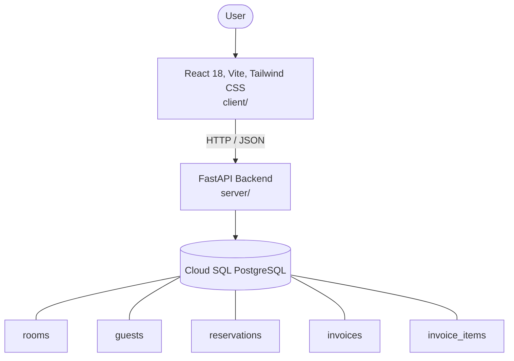

# Architecture

_Auto-generated by the SDLC Assistant from the generated codebase and the approved Feature Spec (latest: SCRUM-234). Regenerated on each push._

## System Diagram

## Tech Stack
- **language**: Python 3.11
- **backend_framework**: FastAPI
- **orm**: SQLAlchemy 2.x
- **database**: Cloud SQL PostgreSQL
- **frontend**: React 18, Vite, Tailwind CSS
- **cloud_provider**: GCP (Cloud Run, Cloud SQL)
- **constitution_section_4_followed**: True

## Backend Modules (server/)
- server/__init__.py
- server/auth.py
- server/database.py
- server/main.py
- server/models.py
- server/routers/__init__.py
- server/routers/auth.py
- server/routers/checkin_checkout.py
- server/routers/invoices.py
- server/routers/reservations.py
- server/routers/rooms.py
- server/schemas.py
- server/tests/__init__.py
- server/tests/conftest.py
- server/tests/test_api.py

## Frontend Modules (client/)
- (no client/ files found yet)

## API Endpoints
- POST /api/v1/auth/login
- GET /api/v1/rooms
- POST /api/v1/rooms
- PATCH /api/v1/rooms/{id}/status
- GET /api/v1/reservations
- POST /api/v1/reservations
- PUT /api/v1/reservations/{id}
- POST /api/v1/reservations/{id}/cancel
- POST /api/v1/check-in
- POST /api/v1/check-out
- GET /api/v1/invoices/{reservation_id}
- POST /api/v1/invoices/{reservation_id}/pay

## Data Model
- rooms
- guests
- reservations
- invoices
- invoice_items
