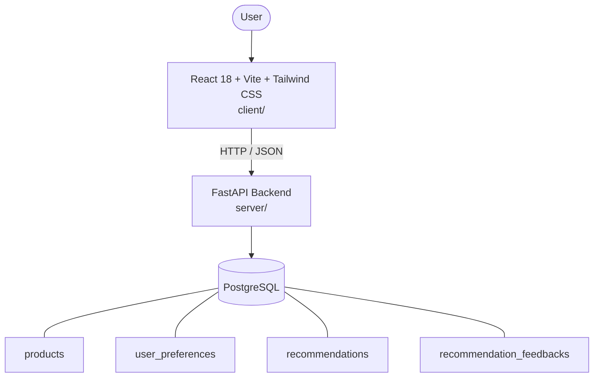

# Architecture

_Auto-generated by the SDLC Assistant from the generated codebase and the approved Feature Spec (latest: SCRUM-244). Regenerated on each push._

## System Diagram

## Tech Stack
- **language**: Python 3.11
- **backend_framework**: FastAPI
- **orm**: SQLAlchemy 2.x
- **database**: PostgreSQL
- **frontend**: React 18 + Vite + Tailwind CSS
- **cloud_provider**: Google Cloud Platform (GCP)
- **constitution_section_4_followed**: True

## Backend Modules (server/)
- server/__init__.py
- server/database.py
- server/main.py
- server/models.py
- server/routers/__init__.py
- server/routers/feedback.py
- server/routers/preferences.py
- server/routers/products.py
- server/routers/recommendations.py
- server/schemas.py
- server/services/__init__.py
- server/services/recommendation_engine.py
- server/tests/__init__.py
- server/tests/conftest.py
- server/tests/test_feedback.py
- server/tests/test_preferences.py
- server/tests/test_products.py
- server/tests/test_recommendations.py

## Frontend Modules (client/)
- (no client/ files found yet)

## API Endpoints
- GET /api/v1/products
- POST /api/v1/preferences
- GET /api/v1/preferences/{user_id}
- POST /api/v1/recommendations/generate
- POST /api/v1/recommendations/feedback

## Data Model
- products
- user_preferences
- recommendations
- recommendation_feedbacks
