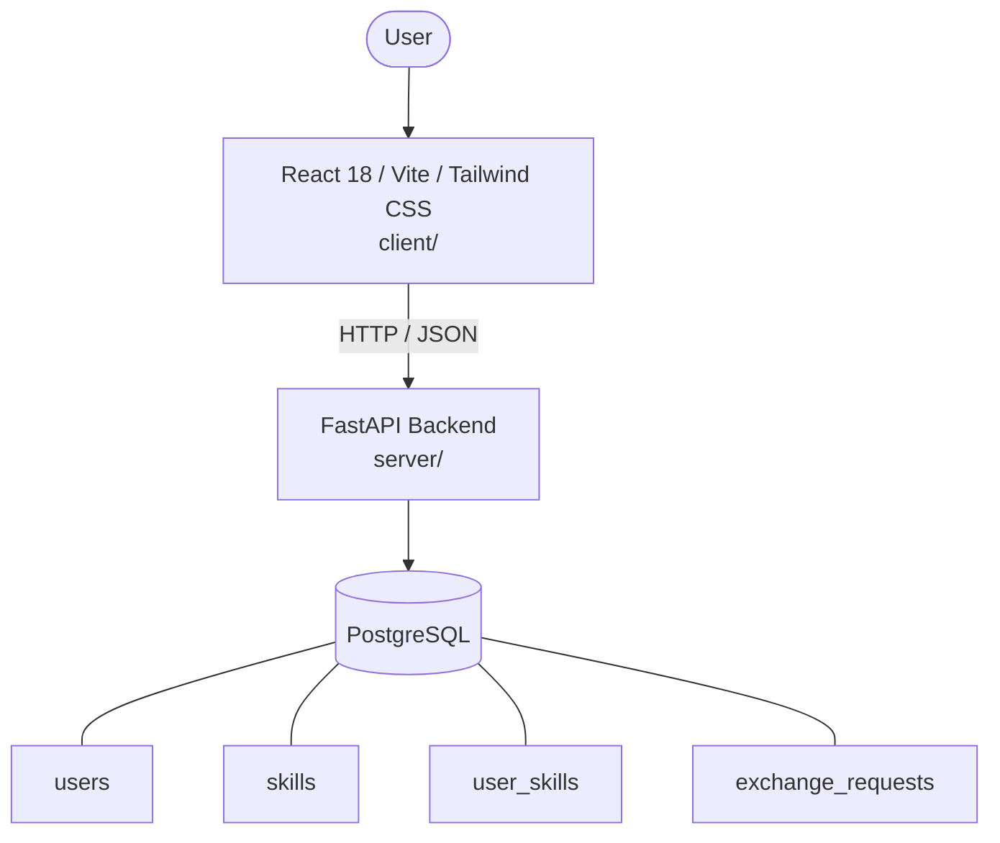

# Architecture

_Auto-generated by the SDLC Assistant from the generated codebase and the approved Feature Spec (latest: SCRUM-119). Regenerated on each push._

## System Diagram

## Tech Stack
- **language**: Python 3.11
- **backend_framework**: FastAPI
- **orm**: SQLAlchemy 2.x
- **database**: PostgreSQL
- **frontend**: React 18 / Vite / Tailwind CSS
- **cloud_provider**: Google Cloud Platform (GCP Cloud Run)
- **constitution_section_4_followed**: True

## Backend Modules (server/)
- server/__init__.py
- server/crud.py
- server/database.py
- server/main.py
- server/models.py
- server/routers/__init__.py
- server/routers/exchanges.py
- server/routers/matches.py
- server/routers/profiles.py
- server/schemas.py
- server/tests/__init__.py
- server/tests/conftest.py
- server/tests/test_exchanges.py
- server/tests/test_matches.py
- server/tests/test_profiles.py

## Frontend Modules (client/)
- (no client/ files found yet)

## API Endpoints
- POST /api/v1/profiles/skills
- GET /api/v1/profiles/me
- GET /api/v1/matches
- POST /api/v1/exchanges
- GET /api/v1/exchanges
- PATCH /api/v1/exchanges/{id}/status

## Data Model
- users
- skills
- user_skills
- exchange_requests
