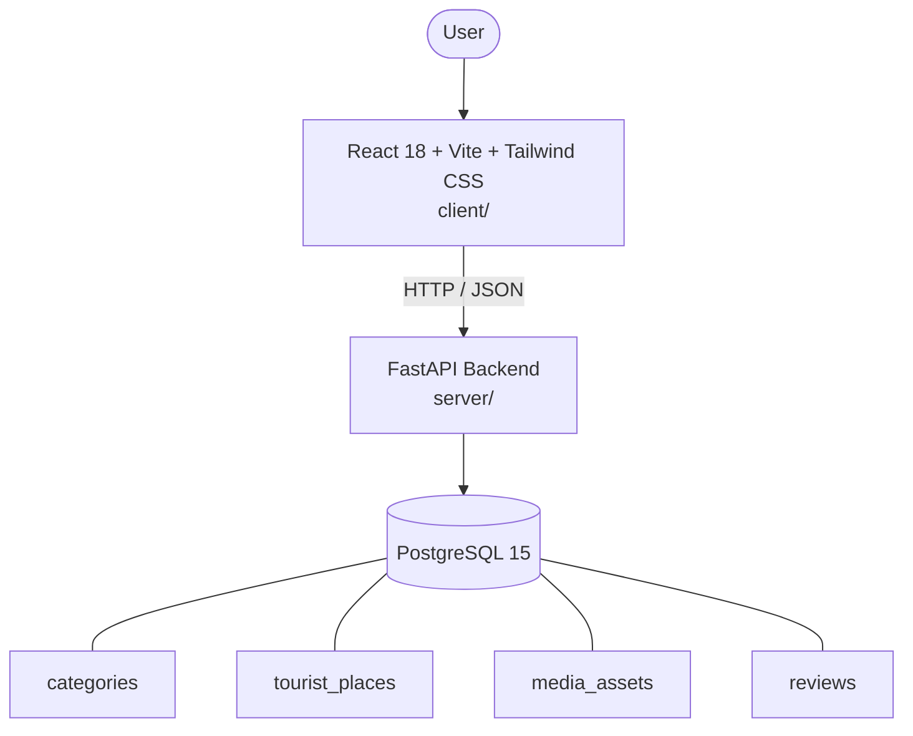

# Architecture

_Auto-generated by the SDLC Assistant from the generated codebase and the approved Feature Spec (latest: SCRUM-255). Regenerated on each push._

## System Diagram

## Tech Stack
- **language**: Python 3.11
- **backend_framework**: FastAPI
- **orm**: SQLAlchemy 2.x
- **database**: PostgreSQL 15
- **frontend**: React 18 + Vite + Tailwind CSS
- **cloud_provider**: GCP (Cloud Run, Cloud SQL, Cloud Storage)
- **constitution_section_4_followed**: True

## Backend Modules (server/)
- server/__init__.py
- server/crud.py
- server/database.py
- server/main.py
- server/models.py
- server/routers/__init__.py
- server/routers/categories.py
- server/routers/places.py
- server/routers/reviews.py
- server/schemas.py
- server/tests/__init__.py
- server/tests/conftest.py
- server/tests/test_categories.py
- server/tests/test_places.py
- server/tests/test_reviews.py

## Frontend Modules (client/)
- (no client/ files found yet)

## API Endpoints
- GET /api/v1/tourist-places
- GET /api/v1/tourist-places/{id}
- GET /api/v1/categories
- POST /api/v1/reviews

## Data Model
- categories
- tourist_places
- media_assets
- reviews
