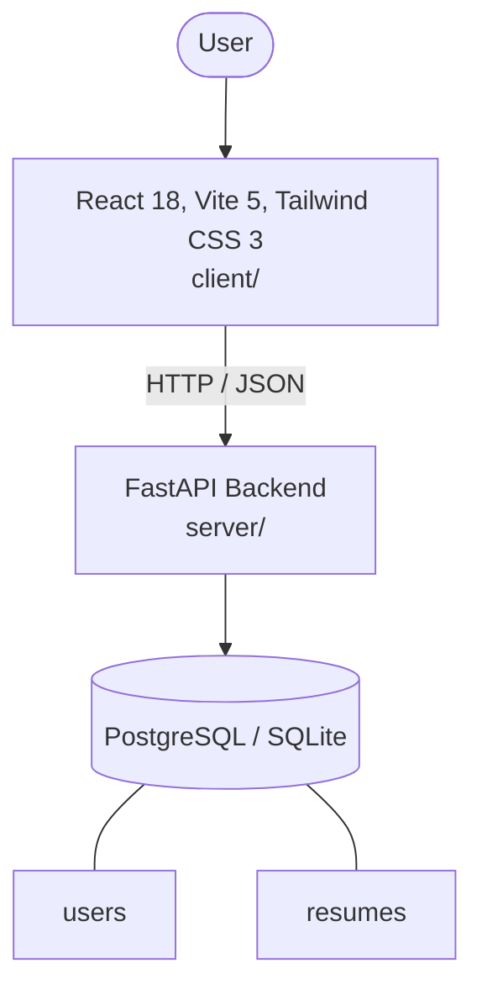

# Architecture

_Auto-generated by the SDLC Assistant from the generated codebase and the approved Feature Spec (latest: SCRUM-261). Regenerated on each push._

## System Diagram

## Tech Stack
- **language**: Python
- **backend_framework**: FastAPI
- **orm**: SQLAlchemy
- **database**: PostgreSQL / SQLite
- **frontend**: React 18, Vite 5, Tailwind CSS 3
- **cloud_provider**: GCP Cloud Run
- **constitution_section_4_followed**: True

## Backend Modules (server/)
- server/__init__.py
- server/database.py
- server/main.py
- server/models.py
- server/routers/__init__.py
- server/routers/auth.py
- server/routers/resumes.py
- server/schemas.py
- server/services/__init__.py
- server/services/auth_service.py
- server/services/pdf_service.py
- server/services/resume_service.py
- server/tests/__init__.py
- server/tests/conftest.py
- server/tests/test_auth.py
- server/tests/test_resumes.py

## Frontend Modules (client/)
- client/eslint.config.js
- client/postcss.config.js
- client/src/App.jsx
- client/src/App.test.jsx
- client/src/components/CertificateVerificationCard.jsx
- client/src/components/Header.jsx
- client/src/components/LiveLeaderboardTable.jsx
- client/src/components/Modal.jsx
- client/src/components/PlayerRegistrationForm.jsx
- client/src/components/PlayerRosterTable.jsx
- client/src/components/ResumeForm.jsx
- client/src/components/ResumePreview.jsx
- client/src/components/Sidebar.jsx
- client/src/components/StatCard.jsx
- client/src/components/SwissPairingMatrix.jsx
- client/src/components/TournamentHeader.jsx
- client/src/components/catalog/AddBookModal.jsx
- client/src/components/catalog/BookCatalogTable.jsx
- client/src/components/common/Badge.jsx
- client/src/components/common/Button.jsx
- client/src/components/common/Modal.jsx
- client/src/components/common/SearchBar.jsx
- client/src/components/dashboard/ActiveLoansTable.jsx
- client/src/components/dashboard/OverdueFinesTable.jsx
- client/src/components/dashboard/QuickActionsPanel.jsx
- client/src/components/dashboard/StatCard.jsx
- client/src/components/inventory/InventoryForm.jsx
- client/src/components/inventory/InventoryTable.jsx
- client/src/components/layout/Header.jsx
- client/src/components/layout/Sidebar.jsx
- client/src/components/member/BookCard.jsx
- client/src/components/member/MyFinesPanel.jsx
- client/src/components/member/MyLoansTable.jsx
- client/src/main.jsx
- client/src/pages/BookCatalogManagement.jsx
- client/src/pages/CertificateVerifyPage.jsx
- client/src/pages/DashboardPage.jsx
- client/src/setup.js
- client/tailwind.config.js
- client/vite.config.js

## API Endpoints
- POST /api/v1/auth/register
- POST /api/v1/auth/login
- GET /api/v1/auth/me
- POST /api/v1/resumes
- POST /api/v1/resumes/export-pdf

## Data Model
- users
- resumes
