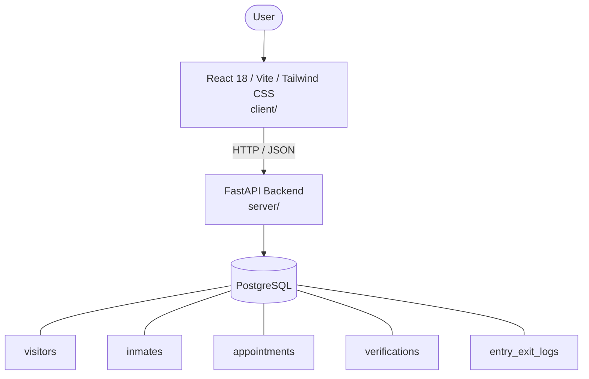

# Architecture

_Auto-generated by the SDLC Assistant from the generated codebase and the approved Feature Spec (latest: SCRUM-202). Regenerated on each push._

## System Diagram

## Tech Stack
- **language**: Python 3.11
- **backend_framework**: FastAPI
- **orm**: SQLAlchemy 2.x
- **database**: PostgreSQL
- **frontend**: React 18 / Vite / Tailwind CSS
- **cloud_provider**: GCP (Cloud Run / Cloud SQL / GCS)
- **constitution_section_4_followed**: True

## Backend Modules (server/)
- server/__init__.py
- server/config.py
- server/database.py
- server/main.py
- server/models/__init__.py
- server/models/appointment.py
- server/models/entry_exit_log.py
- server/models/inmate.py
- server/models/verification.py
- server/models/visitor.py
- server/routers/__init__.py
- server/routers/appointment.py
- server/routers/entry_exit_log.py
- server/routers/inmate.py
- server/routers/verification.py
- server/routers/visitor.py
- server/schemas/__init__.py
- server/schemas/appointment.py
- server/schemas/entry_exit_log.py
- server/schemas/inmate.py
- server/schemas/verification.py
- server/schemas/visitor.py
- server/services/__init__.py
- server/services/appointment_service.py
- server/services/gate_service.py
- server/services/verification_service.py
- server/services/visitor_service.py
- server/tests/__init__.py
- server/tests/conftest.py
- server/tests/test_appointments.py
- server/tests/test_entry_exit.py
- server/tests/test_verifications.py
- server/tests/test_visitors.py

## Frontend Modules (client/)
- (no client/ files found yet)

## API Endpoints
- POST /api/v1/visitors/register
- GET /api/v1/visitors/profile
- GET /api/v1/inmates
- POST /api/v1/appointments
- GET /api/v1/appointments
- PATCH /api/v1/appointments/{id}/status
- POST /api/v1/verifications
- POST /api/v1/entry-exit-logs/check-in
- POST /api/v1/entry-exit-logs/check-out
- GET /api/v1/visitors/{id}/history

## Data Model
- visitors
- inmates
- appointments
- verifications
- entry_exit_logs
