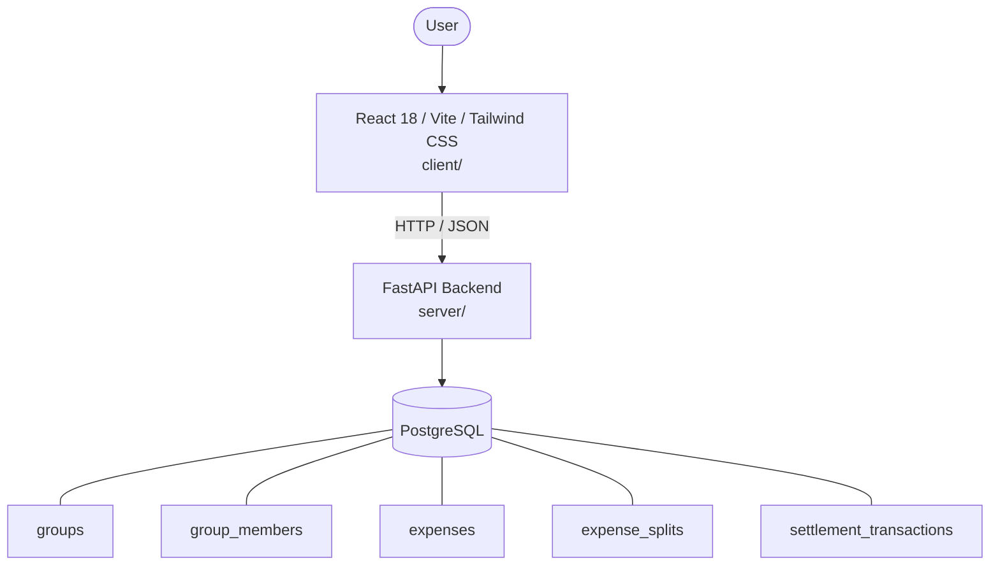

# Architecture

_Auto-generated by the SDLC Assistant from the generated codebase and the approved Feature Spec (latest: SCRUM-210). Regenerated on each push._

## System Diagram

## Tech Stack
- **language**: Python 3.11
- **backend_framework**: FastAPI
- **orm**: SQLAlchemy 2.x
- **database**: PostgreSQL
- **frontend**: React 18 / Vite / Tailwind CSS
- **cloud_provider**: GCP (Cloud Run / Cloud SQL)
- **constitution_section_4_followed**: True

## Backend Modules (server/)
- server/__init__.py
- server/database.py
- server/main.py
- server/models.py
- server/routers/__init__.py
- server/routers/expenses.py
- server/routers/groups.py
- server/routers/settlements.py
- server/schemas.py
- server/services/__init__.py
- server/services/balance_service.py
- server/tests/__init__.py
- server/tests/conftest.py
- server/tests/test_expenses.py
- server/tests/test_groups.py
- server/tests/test_settlements.py

## Frontend Modules (client/)
- (no client/ files found yet)

## API Endpoints
- POST /api/v1/groups
- GET /api/v1/groups/{group_id}
- POST /api/v1/groups/{group_id}/members
- POST /api/v1/expenses
- GET /api/v1/expenses
- GET /api/v1/groups/{group_id}/balances
- POST /api/v1/settlements
- GET /api/v1/groups/{group_id}/settlements

## Data Model
- groups
- group_members
- expenses
- expense_splits
- settlement_transactions
