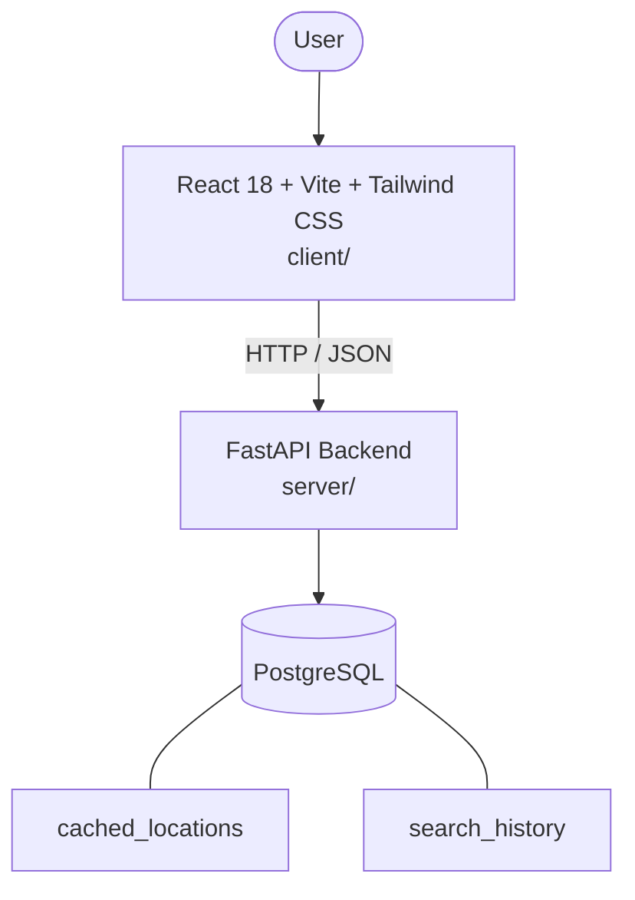

# Architecture

_Auto-generated by the SDLC Assistant from the generated codebase and the approved Feature Spec (latest: SCRUM-185). Regenerated on each push._

## System Diagram

## Tech Stack
- **language**: Python 3.11
- **backend_framework**: FastAPI
- **orm**: SQLAlchemy 2.x
- **database**: PostgreSQL
- **frontend**: React 18 + Vite + Tailwind CSS
- **cloud_provider**: GCP (Cloud Run)
- **constitution_section_4_followed**: True

## Backend Modules (server/)
- server/__init__.py
- server/api/__init__.py
- server/api/v1/__init__.py
- server/api/v1/weather.py
- server/database.py
- server/main.py
- server/models/__init__.py
- server/models/location.py
- server/models/search_history.py
- server/schemas/__init__.py
- server/schemas/weather.py
- server/services/__init__.py
- server/services/cache_service.py
- server/services/weather_service.py
- server/tests/__init__.py
- server/tests/conftest.py
- server/tests/test_weather.py

## Frontend Modules (client/)
- client/postcss.config.js
- client/src/App.jsx
- client/src/components/layout/Header.jsx
- client/src/components/layout/Sidebar.jsx
- client/src/components/map/LayerToggles.jsx
- client/src/components/map/MapControls.jsx
- client/src/components/map/MapView.jsx
- client/src/components/map/TimeSlider.jsx
- client/src/components/panels/GridEditorPanel.jsx
- client/src/components/panels/NWPComparisonPanel.jsx
- client/src/components/panels/TextProductPanel.jsx
- client/src/components/panels/WarningCreationPanel.jsx
- client/src/contexts/AuthContext.jsx
- client/src/hooks/useAuth.js
- client/src/main.jsx
- client/src/pages/DashboardPage.jsx
- client/src/pages/LoginPage.jsx
- client/src/services/api.js
- client/src/setup.js
- client/tailwind.config.js
- client/vite.config.js

## API Endpoints
- GET /api/v1/weather/current
- GET /api/v1/weather/forecast
- GET /api/v1/weather/trends
- GET /api/v1/weather/locations/search

## Data Model
- cached_locations
- search_history
