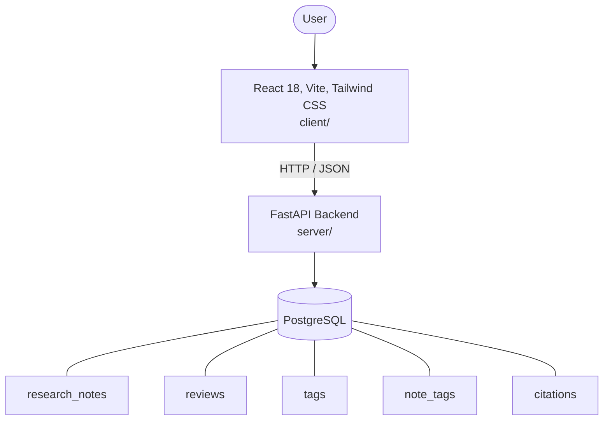

# Architecture

_Auto-generated by the SDLC Assistant from the generated codebase and the approved Feature Spec (latest: SCRUM-265). Regenerated on each push._

## System Diagram

## Tech Stack
- **language**: Python 3.11
- **backend_framework**: FastAPI
- **orm**: SQLAlchemy 2.x
- **database**: PostgreSQL
- **frontend**: React 18, Vite, Tailwind CSS
- **cloud_provider**: GCP Cloud Run
- **constitution_section_4_followed**: True

## Backend Modules (server/)
- server/__init__.py
- server/auth.py
- server/config.py
- server/database.py
- server/main.py
- server/models.py
- server/routers/__init__.py
- server/routers/notes.py
- server/routers/reviews.py
- server/routers/search.py
- server/routers/tags.py
- server/schemas.py
- server/tests/__init__.py
- server/tests/conftest.py
- server/tests/test_notes.py
- server/tests/test_reviews.py
- server/tests/test_search.py

## Frontend Modules (client/)
- (no client/ files found yet)

## API Endpoints
- POST /api/v1/notes
- GET /api/v1/notes
- POST /api/v1/reviews/{id}/approve
- POST /api/v1/reviews/{id}/reject
- GET /api/v1/search

## Data Model
- research_notes
- reviews
- tags
- note_tags
- citations
