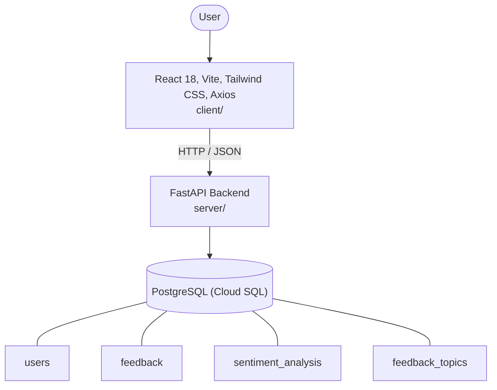

# Architecture

_Auto-generated by the SDLC Assistant from the generated codebase and the approved Feature Spec (latest: SCRUM-219). Regenerated on each push._

## System Diagram

## Tech Stack
- **language**: Python 3.11
- **backend_framework**: FastAPI
- **orm**: SQLAlchemy
- **database**: PostgreSQL (Cloud SQL)
- **frontend**: React 18, Vite, Tailwind CSS, Axios
- **cloud_provider**: GCP (Cloud Run, Cloud SQL)
- **constitution_section_4_followed**: True

## Backend Modules (server/)
- server/__init__.py
- server/auth.py
- server/database.py
- server/main.py
- server/models.py
- server/routers/__init__.py
- server/routers/admin.py
- server/routers/auth.py
- server/routers/feedback.py
- server/schemas.py
- server/services.py
- server/tests/__init__.py
- server/tests/conftest.py
- server/tests/test_admin.py
- server/tests/test_auth.py
- server/tests/test_feedback.py

## Frontend Modules (client/)
- (no client/ files found yet)

## API Endpoints
- POST /api/v1/feedback
- GET /api/v1/feedback/{id}
- GET /api/v1/admin/insights
- GET /api/v1/admin/feedback

## Data Model
- users
- feedback
- sentiment_analysis
- feedback_topics
