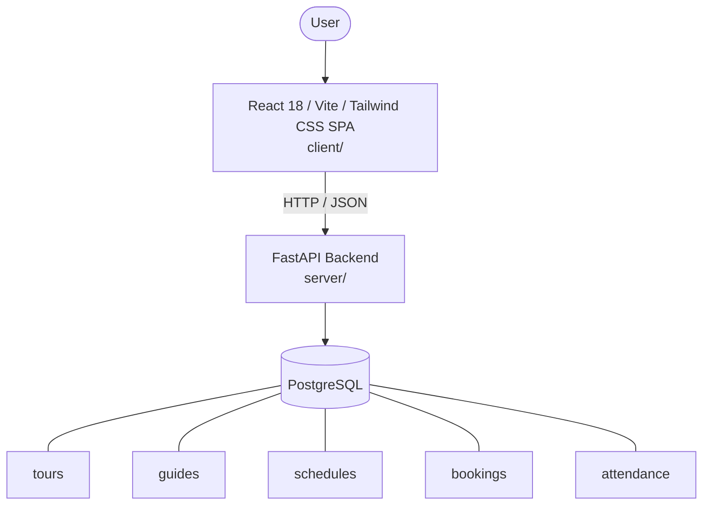

# Architecture

_Auto-generated by the SDLC Assistant from the generated codebase and the approved Feature Spec (latest: SCRUM-193). Regenerated on each push._

## System Diagram

## Tech Stack
- **language**: Python 3.11
- **backend_framework**: FastAPI
- **orm**: SQLAlchemy 2.x
- **database**: PostgreSQL
- **frontend**: React 18 / Vite / Tailwind CSS SPA
- **cloud_provider**: Google Cloud Platform (GCP Cloud Run)
- **constitution_section_4_followed**: True

## Backend Modules (server/)
- server/__init__.py
- server/database.py
- server/main.py
- server/models.py
- server/routers/__init__.py
- server/routers/attendance.py
- server/routers/bookings.py
- server/routers/guides.py
- server/routers/schedules.py
- server/routers/tours.py
- server/schemas.py

## Frontend Modules (client/)
- client/postcss.config.js
- client/src/components/Header.jsx
- client/src/components/PremiumCalculator.jsx
- client/src/components/Sidebar.jsx
- client/src/main.jsx
- client/src/pages/Dashboard.jsx
- client/src/services/api.js
- client/src/setup.js
- client/tailwind.config.js
- client/vite.config.js

## API Endpoints
- GET /api/v1/tours
- POST /api/v1/tours
- GET /api/v1/schedules
- POST /api/v1/schedules
- PUT /api/v1/schedules/{id}
- POST /api/v1/bookings
- GET /api/v1/bookings/{id}
- GET /api/v1/guides
- POST /api/v1/schedules/{id}/assign-guide
- POST /api/v1/attendance/check-in
- GET /api/v1/schedules/{id}/attendance-report

## Data Model
- tours
- guides
- schedules
- bookings
- attendance
