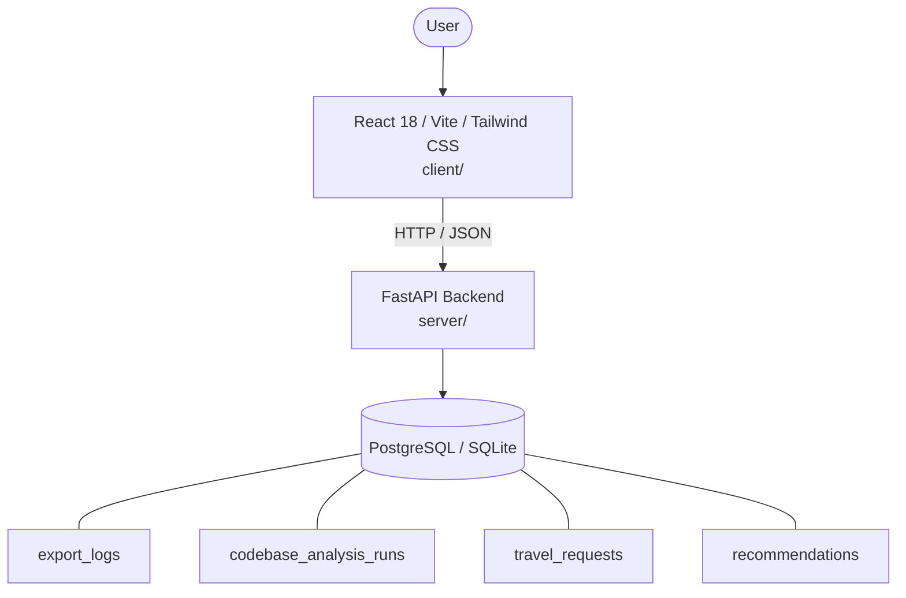

# Architecture

_Auto-generated by the SDLC Assistant from the generated codebase and the approved Feature Spec (latest: SCRUM-231). Regenerated on each push._

## System Diagram

## Tech Stack
- **language**: Python 3.11 / JavaScript (React)
- **backend_framework**: FastAPI
- **orm**: SQLAlchemy
- **database**: PostgreSQL / SQLite
- **frontend**: React 18 / Vite / Tailwind CSS
- **cloud_provider**: Google Cloud Platform (Cloud Run, GCS)
- **constitution_section_4_followed**: True

## Backend Modules (server/)
- server/__init__.py
- server/database.py
- server/main.py
- server/models.py
- server/routers/__init__.py
- server/routers/codebase_analyzer.py
- server/routers/health.py
- server/routers/recommendations.py
- server/schemas.py
- server/services/__init__.py
- server/services/ai_service.py
- server/services/codebase_analyzer_service.py
- server/services/export_service.py
- server/services/recommendation_service.py
- server/tests/__init__.py
- server/tests/conftest.py
- server/tests/test_codebase_analyzer.py
- server/tests/test_export.py
- server/tests/test_health.py
- server/tests/test_recommendations.py

## Frontend Modules (client/)
- client/eslint.config.js
- client/postcss.config.js
- client/src/App.jsx
- client/src/components/BudgetSummaryCard.jsx
- client/src/components/RecommendationForm.jsx
- client/src/components/RecommendationResults.jsx
- client/src/main.jsx
- client/src/pages/HomePage.jsx
- client/src/pages/ResultsPage.jsx
- client/src/services/api.js
- client/src/setup.js
- client/src/tests/RecommendationForm.test.jsx
- client/src/tests/RecommendationResults.test.jsx
- client/tailwind.config.js
- client/vite.config.js

## API Endpoints
- POST /api/v1/recommendations/export
- GET /api/v1/codebase-analyzer/report
- POST /api/v1/codebase-analyzer/run

## Data Model
- export_logs
- codebase_analysis_runs
- travel_requests
- recommendations
