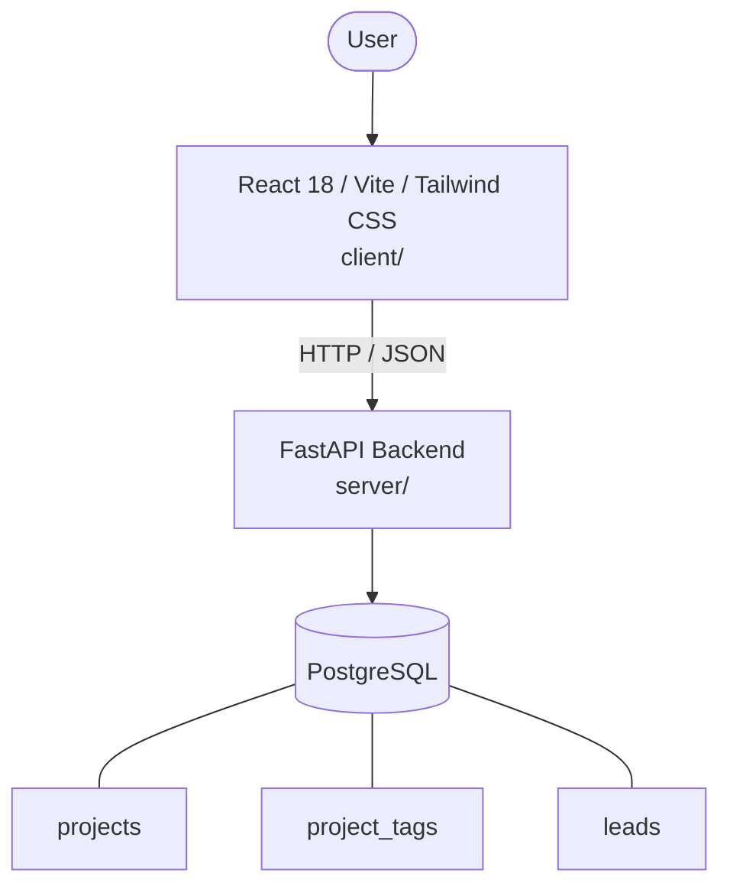

# Architecture

_Auto-generated by the SDLC Assistant from the generated codebase and the approved Feature Spec (latest: SCRUM-183). Regenerated on each push._

## System Diagram

## Tech Stack
- **language**: Python 3.11
- **backend_framework**: FastAPI
- **orm**: SQLAlchemy 2.x
- **database**: PostgreSQL
- **frontend**: React 18 / Vite / Tailwind CSS
- **cloud_provider**: GCP (Cloud Run)
- **constitution_section_4_followed**: True

## Backend Modules (server/)
- server/__init__.py
- server/app/__init__.py
- server/app/api/__init__.py
- server/app/api/v1/__init__.py
- server/app/api/v1/leads.py
- server/app/api/v1/projects.py
- server/app/services/__init__.py
- server/app/services/lead_service.py
- server/app/services/project_service.py
- server/database.py
- server/main.py
- server/models.py
- server/schemas.py
- server/tests/__init__.py
- server/tests/conftest.py
- server/tests/test_leads.py
- server/tests/test_projects.py

## Frontend Modules (client/)
- client/postcss.config.js
- client/src/App.jsx
- client/src/components/BaseRateDisplay.jsx
- client/src/components/CalculateButton.jsx
- client/src/components/Header.jsx
- client/src/components/NCBInput.jsx
- client/src/components/PremiumForm.jsx
- client/src/components/ResultDisplay.jsx
- client/src/components/ResultDisplay.test.jsx
- client/src/components/VehicleMultiplierSlider.jsx
- client/src/main.jsx
- client/src/pages/PremiumCalculatorPage.jsx
- client/src/services/api.js
- client/src/services/api.test.js
- client/src/setup.js
- client/tailwind.config.js
- client/vite.config.js

## API Endpoints
- GET /api/v1/projects
- GET /path/v1/projects/{id}
- POST /api/v1/leads

## Data Model
- projects
- project_tags
- leads
