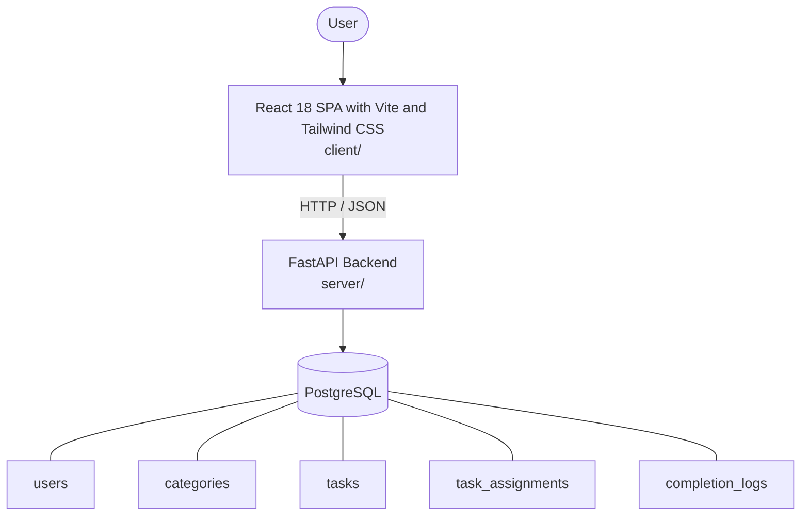

# Architecture

_Auto-generated by the SDLC Assistant from the generated codebase and the approved Feature Spec (latest: SCRUM-96). Regenerated on each push._

## System Diagram

## Tech Stack
- **language**: Python 3.11
- **backend_framework**: FastAPI
- **orm**: SQLAlchemy 2.x
- **database**: PostgreSQL
- **frontend**: React 18 SPA with Vite and Tailwind CSS
- **cloud_provider**: Google Cloud Platform (GCP)
- **constitution_section_4_followed**: True

## Backend Modules (server/)
- server/__init__.py
- server/api/__init__.py
- server/api/v1/__init__.py
- server/api/v1/auth.py
- server/api/v1/categories.py
- server/api/v1/costs.py
- server/api/v1/tasks.py
- server/api/v1/users.py
- server/config.py
- server/conftest.py
- server/database.py
- server/main.py
- server/models/__init__.py
- server/models/category.py
- server/models/completion_log.py
- server/models/task.py
- server/models/task_assignment.py
- server/models/user.py
- server/schemas/__init__.py
- server/schemas/category.py
- server/schemas/completion.py
- server/schemas/cost.py
- server/schemas/task.py
- server/schemas/user.py
- server/security.py
- server/services/__init__.py
- server/services/completion_service.py
- server/services/cost_service.py
- server/services/task_service.py
- server/tests/__init__.py
- server/tests/test_auth.py
- server/tests/test_categories.py
- server/tests/test_completion.py
- server/tests/test_costs.py
- server/tests/test_tasks.py
- server/tests/test_users.py

## Frontend Modules (client/)
- client/postcss.config.js
- client/src/App.jsx
- client/src/App.test.jsx
- client/src/components/AlertStatusDisplay.jsx
- client/src/components/AlertStatusDisplay.test.jsx
- client/src/components/CardInputForm.jsx
- client/src/components/CardInputForm.test.jsx
- client/src/components/OTPVerificationModal.jsx
- client/src/components/OTPVerificationModal.test.jsx
- client/src/components/ui/Button.jsx
- client/src/components/ui/Input.jsx
- client/src/components/ui/Modal.jsx
- client/src/components/ui/RadioGroup.jsx
- client/src/hooks/useAlertSetup.js
- client/src/hooks/useAlertSetup.test.js
- client/src/main.jsx
- client/src/pages/DebitCardSpendAlertSetupPage.jsx
- client/src/services/api.js
- client/src/services/api.test.js
- client/src/setup.js
- client/tailwind.config.js
- client/vite.config.js

## API Endpoints
- POST /api/v1/tasks
- GET /api/v1/tasks
- GET /api/v1/tasks/{id}
- PUT /api/v1/tasks/{id}
- DELETE /api/v1/tasks/{id}
- POST /api/v1/tasks/{id}/assign
- POST /api/v1/tasks/{id}/complete
- GET /api/v1/costs/summary
- GET /api/v1/categories
- GET /api/v1/users

## Data Model
- users
- categories
- tasks
- task_assignments
- completion_logs
