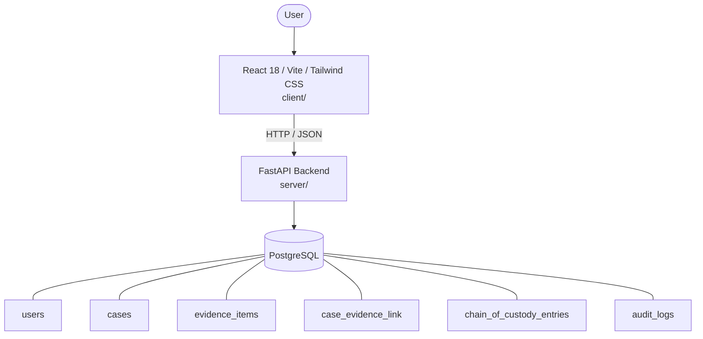

# Architecture

_Auto-generated by the SDLC Assistant from the generated codebase and the approved Feature Spec (latest: SCRUM-236). Regenerated on each push._

## System Diagram

## Tech Stack
- **language**: Python 3.11
- **backend_framework**: FastAPI
- **orm**: SQLAlchemy 2.x
- **database**: PostgreSQL
- **frontend**: React 18 / Vite / Tailwind CSS
- **cloud_provider**: Google Cloud Platform (GCP)
- **constitution_section_4_followed**: True

## Backend Modules (server/)
- server/__init__.py
- server/audit.py
- server/auth.py
- server/database.py
- server/main.py
- server/models.py
- server/rbac.py
- server/routers/__init__.py
- server/routers/audit_logs.py
- server/routers/auth.py
- server/routers/cases.py
- server/routers/chain_of_custody.py
- server/routers/evidence.py
- server/routers/rbac.py
- server/schemas.py
- server/storage.py
- server/tests/__init__.py
- server/tests/conftest.py
- server/tests/test_audit_logs.py
- server/tests/test_auth.py
- server/tests/test_cases.py
- server/tests/test_chain_of_custody.py
- server/tests/test_evidence.py
- server/tests/test_rbac.py

## Frontend Modules (client/)
- (no client/ files found yet)

## API Endpoints
- POST /api/v1/auth/login
- POST /api/v1/evidence/upload-url
- POST /api/v1/evidence/confirm-upload
- POST /api/v1/chain-of-custody/transfer
- GET /api/v1/cases
- GET /api/v1/audit-logs

## Data Model
- users
- cases
- evidence_items
- case_evidence_link
- chain_of_custody_entries
- audit_logs
