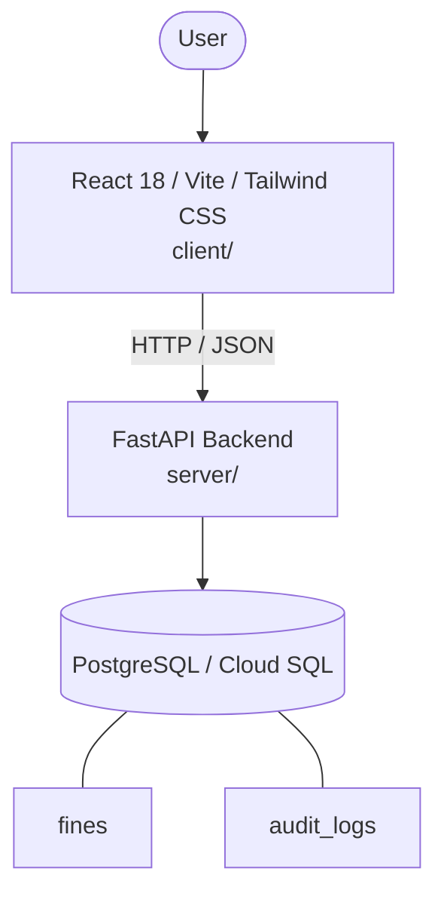

# Architecture

_Auto-generated by the SDLC Assistant from the generated codebase and the approved Feature Spec (latest: SCRUM-147). Regenerated on each push._

## System Diagram

## Tech Stack
- **language**: Python 3.11
- **backend_framework**: FastAPI
- **orm**: SQLAlchemy 2.x
- **database**: PostgreSQL / Cloud SQL
- **frontend**: React 18 / Vite / Tailwind CSS
- **cloud_provider**: Google Cloud Platform (GCP)
- **constitution_section_4_followed**: True

## Backend Modules (server/)
- server/__init__.py
- server/auth.py
- server/database.py
- server/main.py
- server/models.py
- server/routers/__init__.py
- server/routers/admin_fines.py
- server/routers/auth.py
- server/routers/fines.py
- server/schemas.py
- server/services/__init__.py
- server/services/audit_service.py
- server/services/fine_service.py
- server/tests/__init__.py
- server/tests/conftest.py
- server/tests/test_admin_fines.py
- server/tests/test_auth.py
- server/tests/test_fines.py

## Frontend Modules (client/)
- (no client/ files found yet)

## API Endpoints
- GET /api/v1/fines/search
- GET /api/v1/fines/{id}/status
- POST /api/v1/admin/fines
- PUT /api/v1/admin/fines/{id}
- DELETE /api/v1/admin/fines/{id}

## Data Model
- fines
- audit_logs
