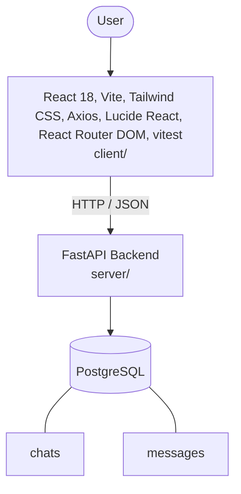

# Architecture

_Auto-generated by the SDLC Assistant from the generated codebase and the approved Feature Spec (latest: SCRUM-115). Regenerated on each push._

## System Diagram

## Tech Stack
- **language**: Python 3.11
- **backend_framework**: FastAPI
- **orm**: SQLAlchemy 2.x
- **database**: PostgreSQL
- **frontend**: React 18, Vite, Tailwind CSS, Axios, Lucide React, React Router DOM, vitest
- **cloud_provider**: Google Cloud Platform (GCP)
- **constitution_section_4_followed**: True

## Backend Modules (server/)
- server/__init__.py
- server/conftest.py
- server/database.py
- server/main.py
- server/models.py
- server/test_main.py

## Frontend Modules (client/)
- (no client/ files found yet)

## API Endpoints
- POST /api/v1/chats
- GET /api/v1/chats
- GET /api/v1/chats/{id}/messages
- POST /api/v1/chats/{id}/messages
- DELETE /api/v1/chats/{id}
- PATCH /api/v1/chats/{id}

## Data Model
- chats
- messages
