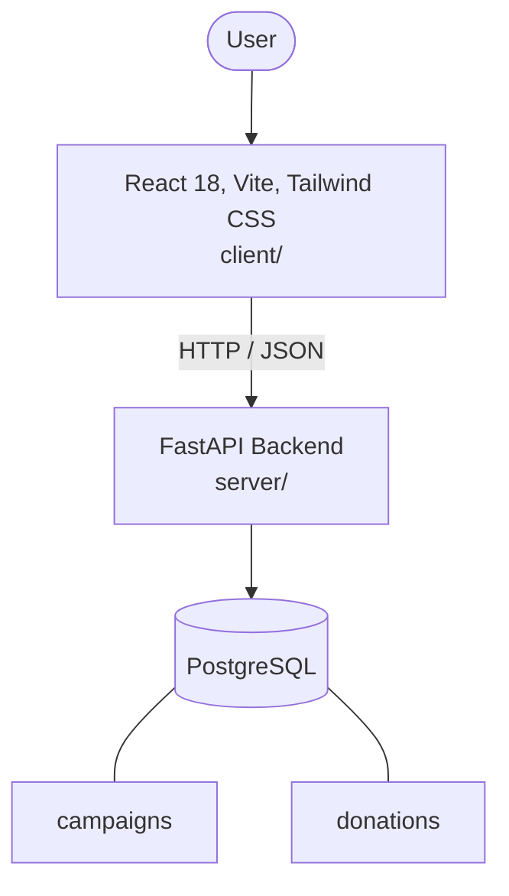

# Architecture

_Auto-generated by the SDLC Assistant from the generated codebase and the approved Feature Spec (latest: SCRUM-172). Regenerated on each push._

## System Diagram

## Tech Stack
- **language**: Python 3.11
- **backend_framework**: FastAPI
- **orm**: SQLAlchemy 2.x
- **database**: PostgreSQL
- **frontend**: React 18, Vite, Tailwind CSS
- **cloud_provider**: Google Cloud Platform (GCP)
- **constitution_section_4_followed**: True

## Backend Modules (server/)
- server/__init__.py
- server/config.py
- server/database.py
- server/main.py
- server/models/__init__.py
- server/models/campaign.py
- server/models/donation.py
- server/models/user.py
- server/routers/__init__.py
- server/routers/auth.py
- server/routers/campaigns.py
- server/routers/donations.py
- server/schemas/__init__.py
- server/schemas/campaign.py
- server/schemas/donation.py
- server/schemas/user.py
- server/services/__init__.py
- server/services/campaign_service.py
- server/services/donation_service.py
- server/tests/__init__.py
- server/tests/conftest.py
- server/tests/test_auth.py
- server/tests/test_campaigns.py
- server/tests/test_donations.py

## Frontend Modules (client/)
- (no client/ files found yet)

## API Endpoints
- GET /api/v1/campaigns
- GET /api/v1/campaigns/{id}
- POST /api/v1/campaigns
- PUT /api/v1/campaigns/{id}
- DELETE /api/v1/campaigns/{id}
- POST /api/v1/donations
- GET /api/v1/donations
- GET /api/v1/donations/my-donations

## Data Model
- campaigns
- donations
