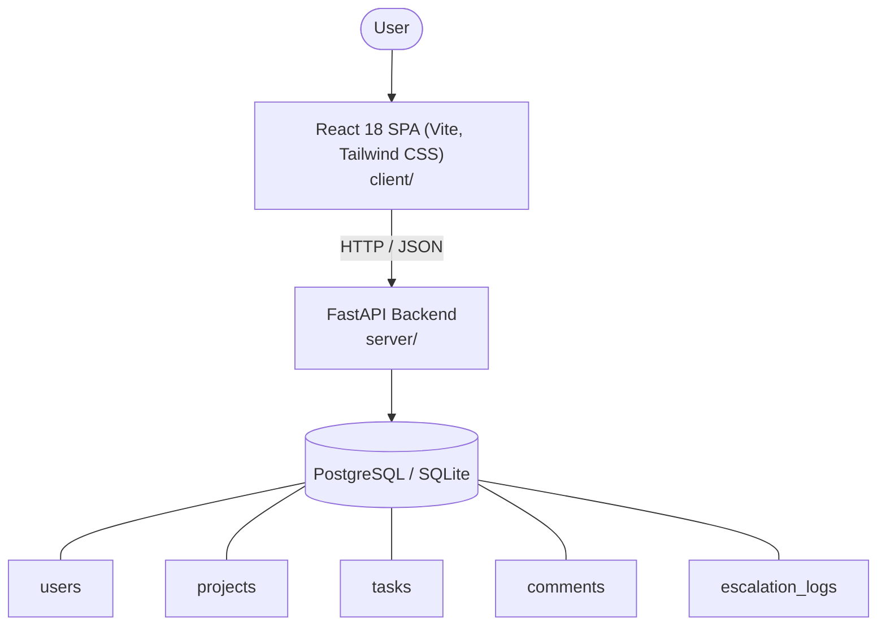

# Architecture

_Auto-generated by the SDLC Assistant from the generated codebase and the approved Feature Spec (latest: SCRUM-192). Regenerated on each push._

## System Diagram

## Tech Stack
- **language**: Python 3.11 / JavaScript (React)
- **backend_framework**: FastAPI
- **orm**: SQLAlchemy 2.x
- **database**: PostgreSQL / SQLite
- **frontend**: React 18 SPA (Vite, Tailwind CSS)
- **cloud_provider**: GCP Cloud Run
- **constitution_section_4_followed**: True

## Backend Modules (server/)
- server/__init__.py
- server/api/__init__.py
- server/api/v1/__init__.py
- server/api/v1/endpoints/__init__.py
- server/api/v1/endpoints/analytics.py
- server/api/v1/endpoints/auth.py
- server/api/v1/endpoints/comments.py
- server/api/v1/endpoints/projects.py
- server/api/v1/endpoints/tasks.py
- server/crud.py
- server/database.py
- server/main.py
- server/models.py
- server/schemas.py
- server/services/__init__.py
- server/services/escalation.py
- server/tests/__init__.py
- server/tests/conftest.py
- server/tests/test_analytics.py
- server/tests/test_auth.py
- server/tests/test_comments.py
- server/tests/test_projects.py
- server/tests/test_tasks.py

## Frontend Modules (client/)
- client/postcss.config.js
- client/src/App.jsx
- client/src/components/PremiumDisplay/BasePremiumCard.jsx
- client/src/components/PremiumDisplay/FinalPremiumCard.jsx
- client/src/components/PremiumDisplay/NCBDiscountCard.jsx
- client/src/components/PremiumDisplay/PolicyDetailsSummary.jsx
- client/src/components/PremiumDisplay/PremiumDisplay.jsx
- client/src/components/PremiumDisplay/VehicleMultiplierCard.jsx
- client/src/components/PremiumForm/NCBHistoryInput.jsx
- client/src/components/PremiumForm/PolicyHolderDetails.jsx
- client/src/components/PremiumForm/PremiumForm.jsx
- client/src/components/PremiumForm/VehicleDetails.jsx
- client/src/main.jsx
- client/src/pages/PremiumCalculatorPage.jsx
- client/src/pages/PremiumCalculatorPage.test.jsx
- client/src/services/api.js
- client/src/services/api.test.js
- client/src/setup.js
- client/tailwind.config.js
- client/vite.config.js

## API Endpoints
- POST /api/v1/auth/register
- POST /api/v1/auth/login
- PATCH /api/v1/tasks/bulk-update

## Data Model
- users
- projects
- tasks
- comments
- escalation_logs
