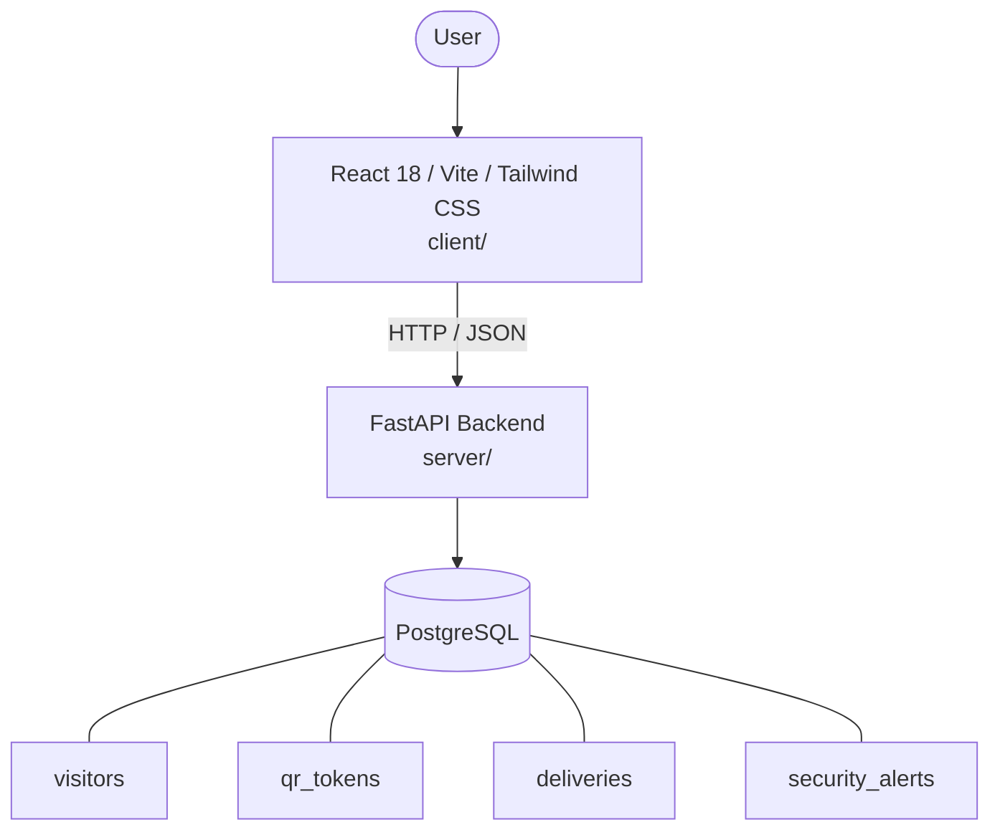

# Architecture

_Auto-generated by the SDLC Assistant from the generated codebase and the approved Feature Spec (latest: SCRUM-228). Regenerated on each push._

## System Diagram

## Tech Stack
- **language**: Python 3.11
- **backend_framework**: FastAPI
- **orm**: SQLAlchemy 2.x
- **database**: PostgreSQL
- **frontend**: React 18 / Vite / Tailwind CSS
- **cloud_provider**: Google Cloud Platform (GCP)
- **constitution_section_4_followed**: True

## Backend Modules (server/)
- server/__init__.py
- server/database.py
- server/main.py
- server/models.py
- server/routers/__init__.py
- server/routers/alerts.py
- server/routers/deliveries.py
- server/routers/visitors.py
- server/schemas.py
- server/tests/__init__.py
- server/tests/conftest.py
- server/tests/test_alerts.py
- server/tests/test_deliveries.py
- server/tests/test_visitors.py

## Frontend Modules (client/)
- client/eslint.config.js
- client/postcss.config.js
- client/src/App.jsx
- client/src/App.test.jsx
- client/src/components/ActiveQRCodeCard.jsx
- client/src/components/DeliveryTable.jsx
- client/src/components/DeliveryTable.test.jsx
- client/src/components/FalseAlarmCancelBanner.jsx
- client/src/components/GateValidationBanner.jsx
- client/src/components/GuardQRScanner.jsx
- client/src/components/GuardQRScanner.test.jsx
- client/src/components/PackageLogForm.jsx
- client/src/components/ResidentVisitorForm.jsx
- client/src/components/ResidentVisitorForm.test.jsx
- client/src/components/SecurityAlertTrigger.jsx
- client/src/components/SecurityAlertTrigger.test.jsx
- client/src/main.jsx
- client/src/pages/DeliveryManagementPage.jsx
- client/src/pages/GuardTerminalPage.jsx
- client/src/pages/ResidentDashboardPage.jsx
- client/src/pages/SecurityBroadcastPage.jsx
- client/src/services/api.js
- client/src/setup.js
- client/tailwind.config.js
- client/vite.config.js

## API Endpoints
- POST /api/v1/visitors/pre-approval
- POST /api/v1/visitors/qr/validate
- POST /api/v1/deliveries
- POST /api/v1/alerts
- POST /api/v1/alerts/{id}/cancel

## Data Model
- visitors
- qr_tokens
- deliveries
- security_alerts
