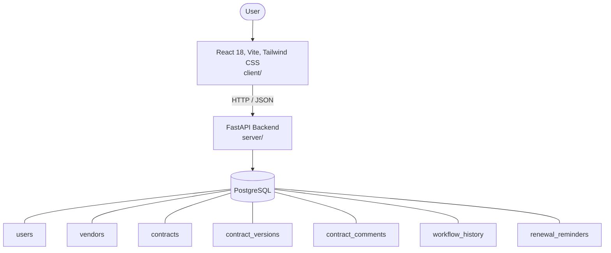

# Architecture

_Auto-generated by the SDLC Assistant from the generated codebase and the approved Feature Spec (latest: SCRUM-276). Regenerated on each push._

## System Diagram

## Tech Stack
- **language**: Python 3.11
- **backend_framework**: FastAPI
- **orm**: SQLAlchemy 2.x
- **database**: PostgreSQL
- **frontend**: React 18, Vite, Tailwind CSS
- **cloud_provider**: GCP (Cloud Run, Cloud SQL, Cloud Storage)
- **constitution_section_4_followed**: True

## Backend Modules (server/)
- server/__init__.py
- server/auth.py
- server/database.py
- server/main.py
- server/models.py
- server/routers/__init__.py
- server/routers/approvals.py
- server/routers/auth.py
- server/routers/comments.py
- server/routers/contracts.py
- server/routers/reminders.py
- server/schemas.py
- server/services.py
- server/tests/__init__.py
- server/tests/conftest.py
- server/tests/test_approvals.py
- server/tests/test_comments.py
- server/tests/test_contracts.py
- server/tests/test_reminders.py

## Frontend Modules (client/)
- (no client/ files found yet)

## API Endpoints
- POST /api/v1/contracts
- GET /api/v1/contracts
- GET /api/v1/contracts/{id}
- PUT /api/v1/contracts/{id}
- GET /api/v1/contracts/{id}/versions
- POST /api/v1/contracts/{id}/comments
- GET /api/v1/contracts/{id}/comments
- POST /api/v1/contracts/{id}/approvals
- GET /api/v1/reminders
- POST /api/v1/reminders/process

## Data Model
- users
- vendors
- contracts
- contract_versions
- contract_comments
- workflow_history
- renewal_reminders
