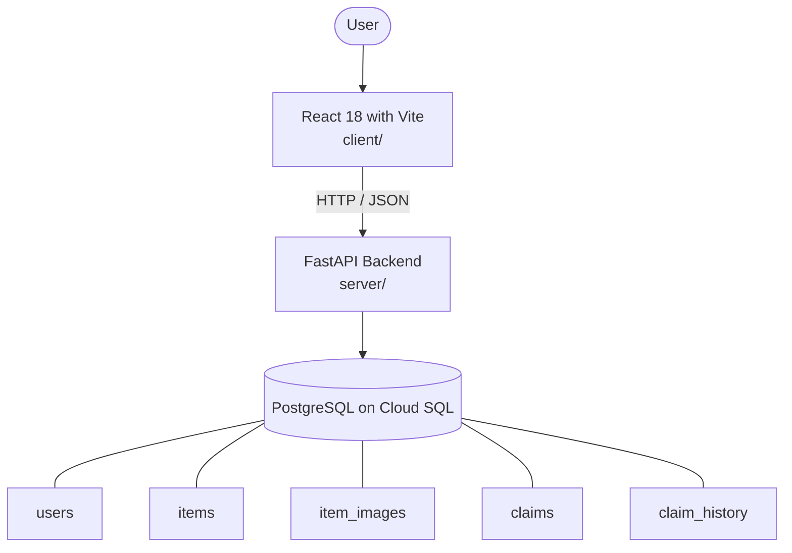

# Architecture

_Auto-generated by the SDLC Assistant from the generated codebase and the approved Feature Spec (latest: SCRUM-76). Regenerated on each push._

## System Diagram

## Tech Stack
- **language**: Python 3.11
- **backend_framework**: FastAPI
- **orm**: SQLAlchemy 2.x
- **database**: PostgreSQL on Cloud SQL
- **frontend**: React 18 with Vite
- **cloud_provider**: GCP
- **constitution_section_4_followed**: True

## Backend Modules (server/)
- server/__init__.py
- server/ai_matching.py
- server/crud.py
- server/database.py
- server/main.py
- server/models.py
- server/routers/__init__.py
- server/routers/admin.py
- server/routers/claims.py
- server/routers/items.py
- server/routers/matches.py
- server/schemas.py
- server/security.py
- server/tests/__init__.py
- server/tests/conftest.py
- server/tests/test_admin.py
- server/tests/test_claims.py
- server/tests/test_items.py
- server/tests/test_matches.py

## Frontend Modules (client/)
- (no client/ files found yet)

## API Endpoints
- POST /api/v1/items
- GET /api/v1/items
- GET /api/v1/items/{item_id}
- GET /api/v1/items/{item_id}/matches
- POST /api/v1/claims
- GET /admin/claims
- POST /admin/claims/{claim_id}/verify
- GET /admin/items/{item_id}/history

## Data Model
- users
- items
- item_images
- claims
- claim_history
