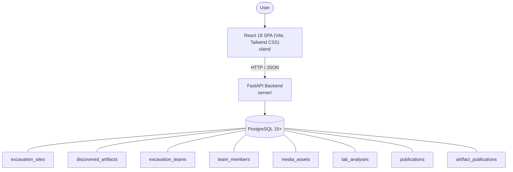

# Architecture

_Auto-generated by the SDLC Assistant from the generated codebase and the approved Feature Spec (latest: SCRUM-211). Regenerated on each push._

## System Diagram

## Tech Stack
- **language**: Python 3.11
- **backend_framework**: FastAPI 0.100+
- **orm**: SQLAlchemy 2.0+
- **database**: PostgreSQL 15+
- **frontend**: React 18 SPA (Vite, Tailwind CSS)
- **cloud_provider**: GCP (Cloud Run, Cloud SQL, Google Cloud Storage)
- **constitution_section_4_followed**: True

## Backend Modules (server/)
- server/__init__.py
- server/database.py
- server/main.py
- server/models.py
- server/routers/__init__.py
- server/routers/artifacts.py
- server/routers/dashboard.py
- server/routers/lab_analyses.py
- server/routers/media.py
- server/routers/publications.py
- server/routers/sites.py
- server/routers/teams.py
- server/schemas.py
- server/tests/__init__.py
- server/tests/conftest.py
- server/tests/test_artifacts.py
- server/tests/test_dashboard.py
- server/tests/test_lab_analyses.py
- server/tests/test_media.py
- server/tests/test_publications.py
- server/tests/test_sites.py
- server/tests/test_teams.py

## Frontend Modules (client/)
- (no client/ files found yet)

## API Endpoints
- POST /api/v1/sites
- GET /api/v1/sites
- GET /api/v1/sites/{id}
- POST /api/v1/artifacts
- GET /api/v1/artifacts
- POST /api/v1/teams
- POST /api/v1/teams/{id}/members
- POST /api/v1/media/upload
- POST /api/v1/lab-analyses
- PATCH /api/v1/lab-analyses/{id}
- POST /api/v1/publications
- POST /api/v1/publications/link

## Data Model
- excavation_sites
- discovered_artifacts
- excavation_teams
- team_members
- media_assets
- lab_analyses
- publications
- artifact_publications
