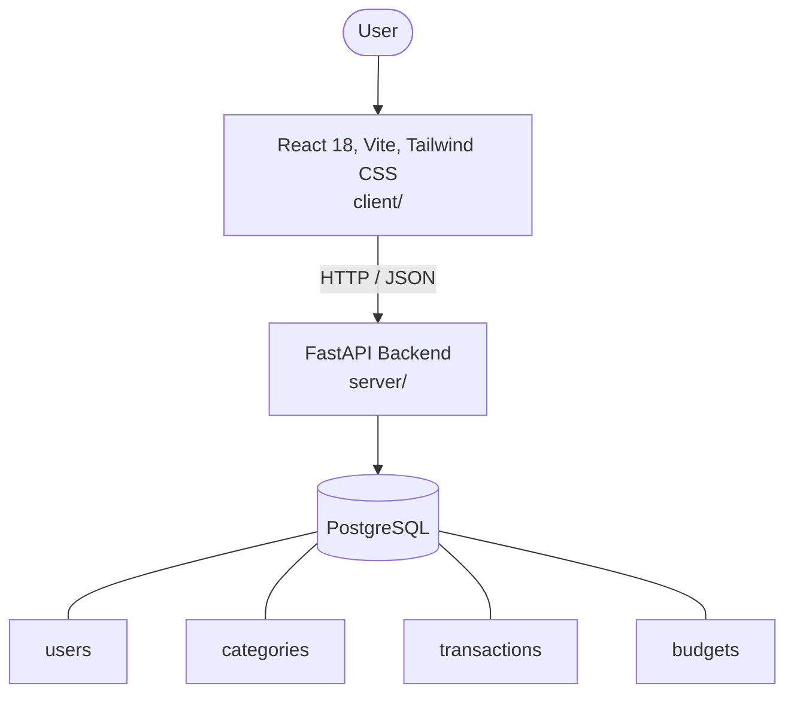

# Architecture

_Auto-generated by the SDLC Assistant from the generated codebase and the approved Feature Spec (latest: SCRUM-232). Regenerated on each push._

## System Diagram

## Tech Stack
- **language**: Python 3.11
- **backend_framework**: FastAPI
- **orm**: SQLAlchemy 2.x
- **database**: PostgreSQL
- **frontend**: React 18, Vite, Tailwind CSS
- **cloud_provider**: GCP Cloud Run
- **constitution_section_4_followed**: True

## Backend Modules (server/)
- server/__init__.py
- server/auth.py
- server/database.py
- server/main.py
- server/models.py
- server/routers/__init__.py
- server/routers/auth.py
- server/routers/budgets.py
- server/routers/categories.py
- server/routers/expenses.py
- server/routers/reports.py
- server/schemas.py
- server/services/__init__.py
- server/services/report_generator.py
- server/tests/__init__.py
- server/tests/conftest.py
- server/tests/test_auth.py
- server/tests/test_budgets.py
- server/tests/test_categories.py
- server/tests/test_expenses.py
- server/tests/test_reports.py

## Frontend Modules (client/)
- (no client/ files found yet)

## API Endpoints
- POST /api/v1/auth/login
- GET /api/v1/expenses
- POST /api/v1/expenses
- PUT /api/v1/expenses/{id}
- DELETE /api/v1/expenses/{id}
- GET /api/v1/categories
- POST /api/v1/categories
- GET /api/v1/budgets
- POST /api/v1/budgets
- GET /api/v1/reports/summary
- GET /api/v1/reports/export

## Data Model
- users
- categories
- transactions
- budgets
