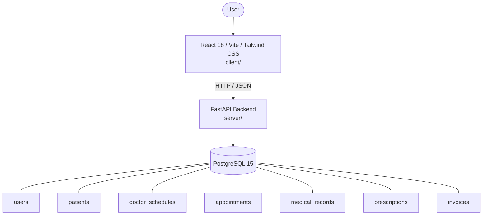

# Architecture

_Auto-generated by the SDLC Assistant from the generated codebase and the approved Feature Spec (latest: SCRUM-123). Regenerated on each push._

## System Diagram

## Tech Stack
- **language**: Python 3.11
- **backend_framework**: FastAPI
- **orm**: SQLAlchemy 2.x
- **database**: PostgreSQL 15
- **frontend**: React 18 / Vite / Tailwind CSS
- **cloud_provider**: GCP (Cloud Run / Cloud SQL)
- **constitution_section_4_followed**: True

## Backend Modules (server/)
- server/__init__.py
- server/database.py
- server/main.py
- server/models.py
- server/routers/__init__.py
- server/routers/appointments.py
- server/routers/auth.py
- server/routers/billing.py
- server/routers/medical.py
- server/routers/patients.py
- server/routers/schedules.py
- server/schemas.py
- server/security.py
- server/tests/__init__.py
- server/tests/conftest.py
- server/tests/test_appointments.py
- server/tests/test_auth.py
- server/tests/test_billing.py
- server/tests/test_medical.py
- server/tests/test_patients.py

## Frontend Modules (client/)
- (no client/ files found yet)

## API Endpoints
- POST /api/v1/auth/register
- POST /api/v1/auth/login
- POST /api/v1/patients
- GET /api/v1/patients
- GET /api/v1/schedules/doctors/{doctor_id}
- POST /api/v1/appointments
- POST /api/v1/medical-records
- POST /api/v1/prescriptions
- GET /api/v1/invoices
- POST /api/v1/invoices/{id}/pay

## Data Model
- users
- patients
- doctor_schedules
- appointments
- medical_records
- prescriptions
- invoices
