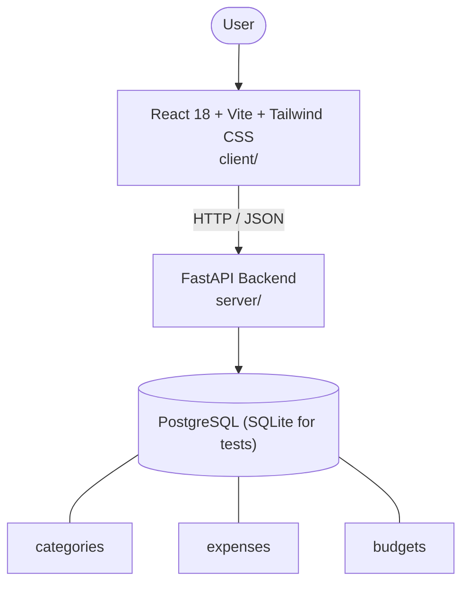

# Architecture

_Auto-generated by the SDLC Assistant from the generated codebase and the approved Feature Spec (latest: SCRUM-154). Regenerated on each push._

## System Diagram

## Tech Stack
- **language**: Python 3.11 / JavaScript
- **backend_framework**: FastAPI
- **orm**: SQLAlchemy 2.x
- **database**: PostgreSQL (SQLite for tests)
- **frontend**: React 18 + Vite + Tailwind CSS
- **cloud_provider**: Google Cloud Platform (GCP)
- **constitution_section_4_followed**: True

## Backend Modules (server/)
- server/__init__.py
- server/crud/__init__.py
- server/crud/analytics.py
- server/crud/budget.py
- server/crud/category.py
- server/crud/expense.py
- server/database.py
- server/main.py
- server/models/__init__.py
- server/models/budget.py
- server/models/category.py
- server/models/expense.py
- server/routers/__init__.py
- server/routers/analytics.py
- server/routers/budgets.py
- server/routers/categories.py
- server/routers/expenses.py
- server/schemas/__init__.py
- server/schemas/analytics.py
- server/schemas/budget.py
- server/schemas/category.py
- server/schemas/expense.py
- server/tests/__init__.py
- server/tests/conftest.py
- server/tests/test_analytics.py
- server/tests/test_budgets.py
- server/tests/test_categories.py
- server/tests/test_expenses.py

## Frontend Modules (client/)
- (no client/ files found yet)

## API Endpoints
- GET /api/v1/categories
- POST /api/v1/categories
- GET /api/v1/categories/{id}
- PUT /api/v1/categories/{id}
- DELETE /api/v1/categories/{id}
- GET /api/v1/expenses
- POST /api/v1/expenses
- GET /api/v1/expenses/{id}
- PUT /api/v1/expenses/{id}
- DELETE /api/v1/expenses/{id}
- GET /api/v1/budgets
- POST /api/v1/budgets
- GET /api/v1/budgets/{id}
- DELETE /api/v1/budgets/{id}
- GET /api/v1/analytics/summary
- GET /api/v1/analytics/category-breakdown
- GET /api/v1/analytics/monthly-trend

## Data Model
- categories
- expenses
- budgets
