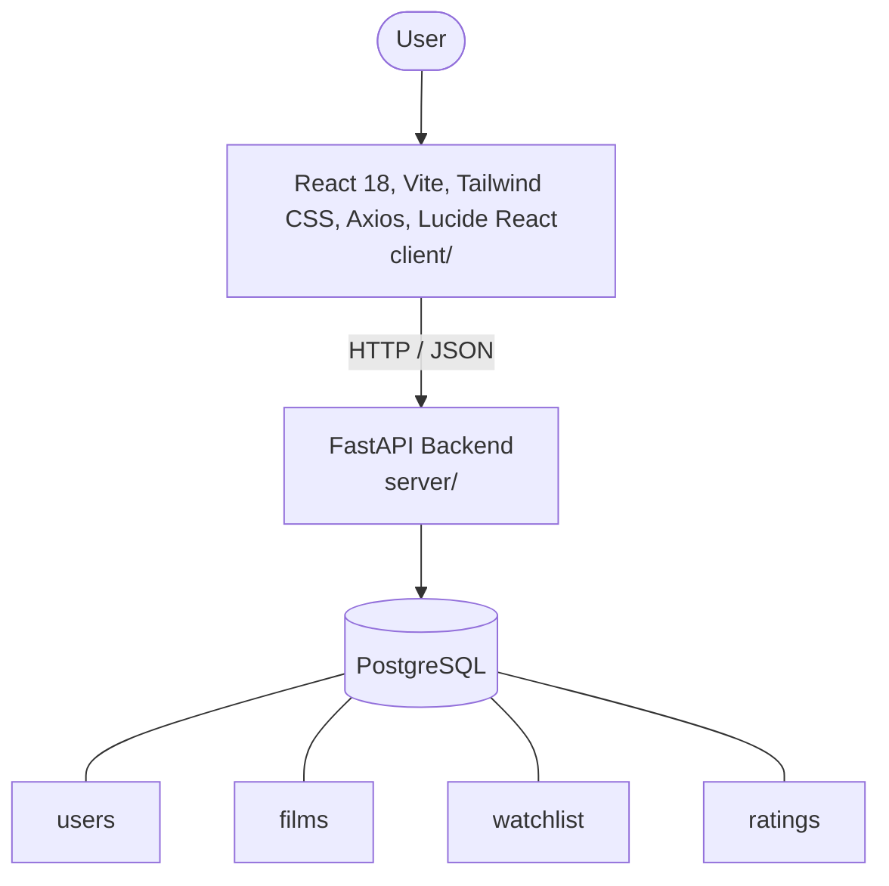

# Architecture

_Auto-generated by the SDLC Assistant from the generated codebase and the approved Feature Spec (latest: SCRUM-156). Regenerated on each push._

## System Diagram

## Tech Stack
- **language**: Python 3.11
- **backend_framework**: FastAPI
- **orm**: SQLAlchemy 2.x
- **database**: PostgreSQL
- **frontend**: React 18, Vite, Tailwind CSS, Axios, Lucide React
- **cloud_provider**: Google Cloud Platform (GCP)
- **constitution_section_4_followed**: True

## Backend Modules (server/)
- server/__init__.py
- server/app/__init__.py
- server/app/config.py
- server/app/database.py
- server/app/main.py
- server/app/models/__init__.py
- server/app/models/film.py
- server/app/models/rating.py
- server/app/models/user.py
- server/app/models/watchlist.py
- server/app/routers/__init__.py
- server/app/routers/films.py
- server/app/routers/ratings.py
- server/app/routers/watchlist.py
- server/app/schemas/__init__.py
- server/app/schemas/film.py
- server/app/schemas/rating.py
- server/app/schemas/watchlist.py
- server/tests/__init__.py
- server/tests/conftest.py
- server/tests/test_films.py
- server/tests/test_ratings.py
- server/tests/test_watchlist.py

## Frontend Modules (client/)
- (no client/ files found yet)

## API Endpoints
- GET /api/v1/films
- GET /api/v1/watchlist
- POST /api/v1/watchlist
- DELETE /api/v1/watchlist/{film_id}
- POST /api/v1/ratings
- GET /api/v1/ratings

## Data Model
- users
- films
- watchlist
- ratings
