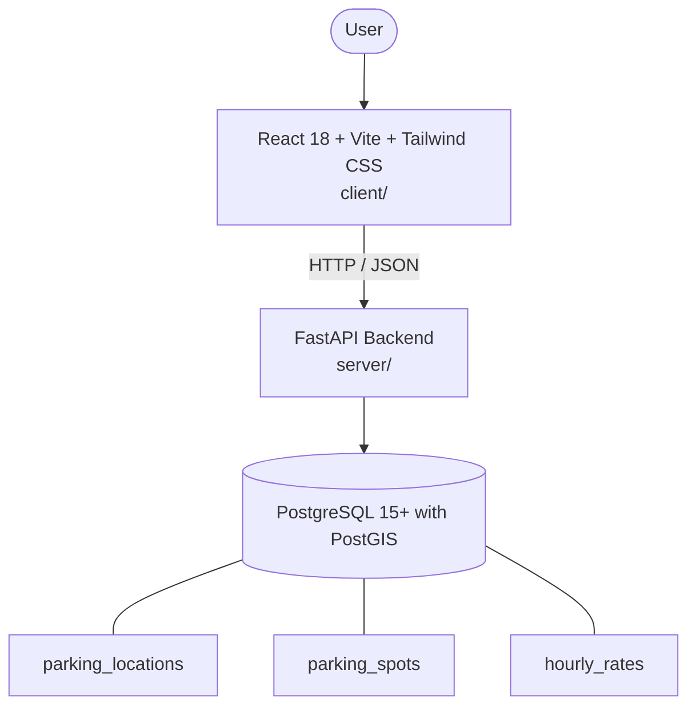

# Architecture

_Auto-generated by the SDLC Assistant from the generated codebase and the approved Feature Spec (latest: SCRUM-204). Regenerated on each push._

## System Diagram

## Tech Stack
- **language**: Python 3.11 / JavaScript (React 18)
- **backend_framework**: FastAPI
- **orm**: SQLAlchemy 2.x + GeoAlchemy2
- **database**: PostgreSQL 15+ with PostGIS
- **frontend**: React 18 + Vite + Tailwind CSS
- **cloud_provider**: GCP (Cloud Run + Cloud SQL)
- **constitution_section_4_followed**: True

## Backend Modules (server/)
- server/__init__.py
- server/api/__init__.py
- server/api/v1/__init__.py
- server/api/v1/endpoints/__init__.py
- server/api/v1/endpoints/parking_spots.py
- server/api/v1/endpoints/realtime.py
- server/database.py
- server/main.py
- server/models/__init__.py
- server/models/parking.py
- server/schemas/__init__.py
- server/schemas/parking.py
- server/services/__init__.py
- server/services/parking_service.py
- server/services/realtime_service.py
- server/tests/__init__.py
- server/tests/conftest.py
- server/tests/test_parking_spots.py

## Frontend Modules (client/)
- client/eslint.config.js
- client/postcss.config.js
- client/src/App.jsx
- client/src/App.test.jsx
- client/src/components/common/Badge.jsx
- client/src/components/common/Button.jsx
- client/src/components/common/Modal.jsx
- client/src/components/common/SearchBar.jsx
- client/src/components/layout/Header.jsx
- client/src/components/layout/Sidebar.jsx
- client/src/components/rates/RateBreakdownCard.jsx
- client/src/components/rates/RateBreakdownCard.test.jsx
- client/src/components/search/FilterToolbar.jsx
- client/src/components/search/FilterToolbar.test.jsx
- client/src/components/search/SearchBar.jsx
- client/src/components/search/SearchBar.test.jsx
- client/src/components/spots/MapViewport.jsx
- client/src/components/spots/MapViewport.test.jsx
- client/src/components/spots/SpotCard.jsx
- client/src/components/spots/SpotCard.test.jsx
- client/src/main.jsx
- client/src/pages/MonitorPage.jsx
- client/src/pages/SearchPage.jsx
- client/src/pages/SpotDetailPage.jsx
- client/src/services/api.js
- client/src/services/api.test.js
- client/src/setup.js
- client/tailwind.config.js
- client/vite.config.js

## API Endpoints
- GET /api/v1/parking-spots/search
- GET /api/v1/parking-spots/{spot_id}
- GET /api/v1/parking-spots/{spot_id}/rates
- POST /api/v1/parking-spots/{spot_id}/status
- WS /api/v1/parking-spots/live-updates

## Data Model
- parking_locations
- parking_spots
- hourly_rates
