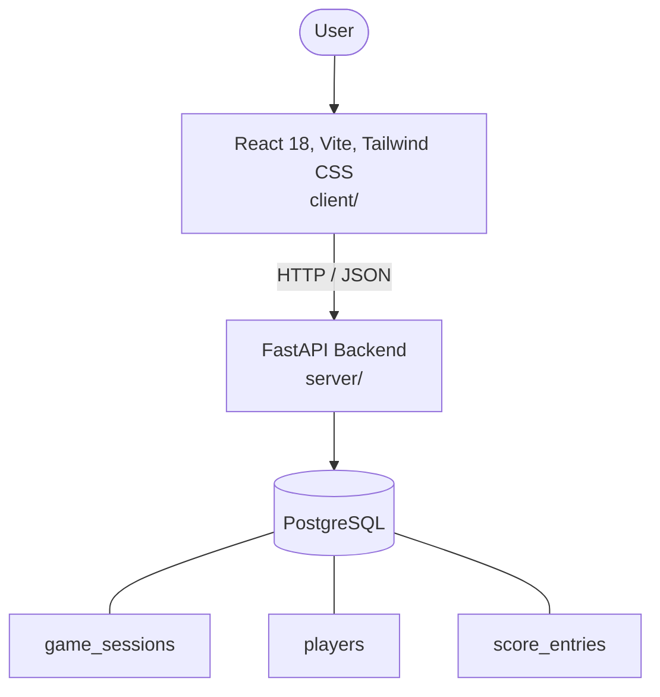

# Architecture

_Auto-generated by the SDLC Assistant from the generated codebase and the approved Feature Spec (latest: SCRUM-222). Regenerated on each push._

## System Diagram

## Tech Stack
- **language**: Python 3.11
- **backend_framework**: FastAPI
- **orm**: SQLAlchemy 2.x
- **database**: PostgreSQL
- **frontend**: React 18, Vite, Tailwind CSS
- **cloud_provider**: GCP Cloud Run
- **constitution_section_4_followed**: True

## Backend Modules (server/)
- server/__init__.py
- server/config.py
- server/crud.py
- server/database.py
- server/main.py
- server/models.py
- server/routers/__init__.py
- server/routers/players.py
- server/routers/scores.py
- server/routers/sessions.py
- server/schemas.py
- server/tests/__init__.py
- server/tests/conftest.py
- server/tests/test_players.py
- server/tests/test_scores.py
- server/tests/test_sessions.py

## Frontend Modules (client/)
- (no client/ files found yet)

## API Endpoints
- POST /api/v1/sessions
- GET /api/v1/sessions/{session_id}
- POST /api/v1/sessions/{session_id}/players
- GET /api/v1/sessions/{session_id}/players
- POST /api/v1/sessions/{session_id}/scores
- GET /api/v1/sessions/{session_id}/leaderboard

## Data Model
- game_sessions
- players
- score_entries
