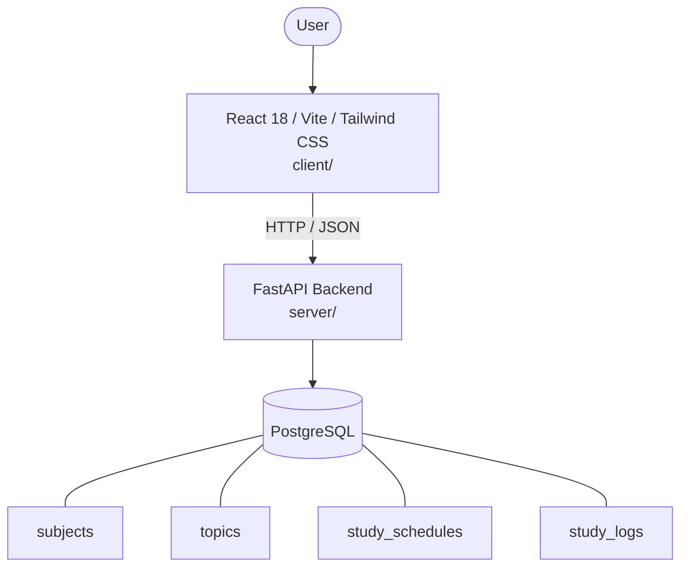

# Architecture

_Auto-generated by the SDLC Assistant from the generated codebase and the approved Feature Spec (latest: SCRUM-220). Regenerated on each push._

## System Diagram

## Tech Stack
- **language**: Python 3.11
- **backend_framework**: FastAPI
- **orm**: SQLAlchemy 2.x
- **database**: PostgreSQL
- **frontend**: React 18 / Vite / Tailwind CSS
- **cloud_provider**: GCP (Cloud Run, Cloud SQL)
- **constitution_section_4_followed**: True

## Backend Modules (server/)
- server/__init__.py
- server/api/__init__.py
- server/api/logs.py
- server/api/recommendations.py
- server/api/schedules.py
- server/api/subjects.py
- server/api/topics.py
- server/config.py
- server/database.py
- server/main.py
- server/models.py
- server/schemas.py
- server/services/__init__.py
- server/services/recommendation_engine.py
- server/tests/__init__.py
- server/tests/conftest.py
- server/tests/test_logs.py
- server/tests/test_recommendations.py
- server/tests/test_schedules.py
- server/tests/test_subjects.py
- server/tests/test_topics.py

## Frontend Modules (client/)
- (no client/ files found yet)

## API Endpoints
- POST /api/v1/subjects
- GET /api/v1/subjects
- GET /api/v1/subjects/{id}
- PUT /api/v1/subjects/{id}
- DELETE /api/v1/subjects/{id}
- POST /api/v1/topics
- PATCH /api/v1/topics/{id}/status
- POST /api/v1/schedules
- GET /api/v1/schedules
- POST /api/v1/study-logs
- GET /api/v1/recommendations/next-topics

## Data Model
- subjects
- topics
- study_schedules
- study_logs
