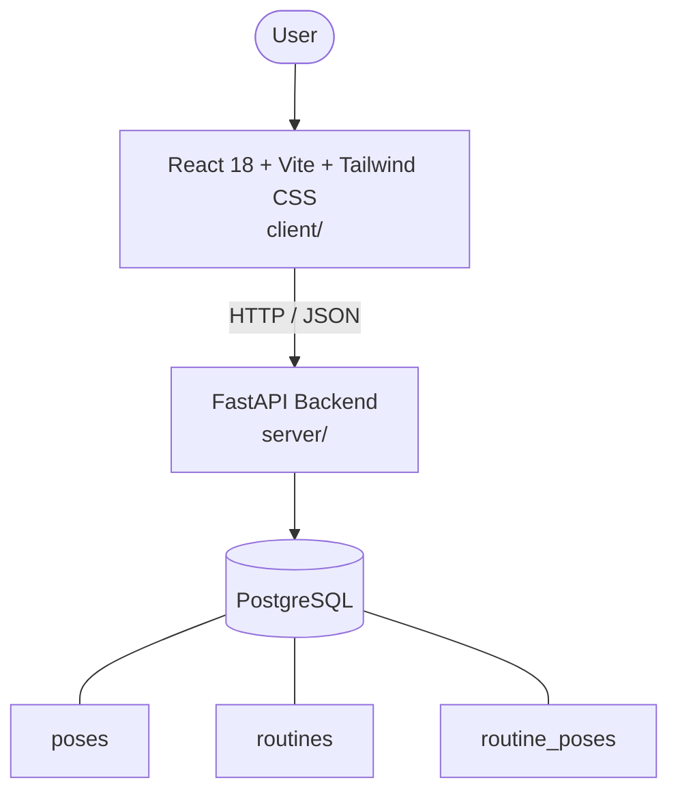

# Architecture

_Auto-generated by the SDLC Assistant from the generated codebase and the approved Feature Spec (latest: SCRUM-246). Regenerated on each push._

## System Diagram

## Tech Stack
- **language**: Python 3.11
- **backend_framework**: FastAPI
- **orm**: SQLAlchemy 2.x
- **database**: PostgreSQL
- **frontend**: React 18 + Vite + Tailwind CSS
- **cloud_provider**: GCP (Cloud Run)
- **constitution_section_4_followed**: True

## Backend Modules (server/)
- server/__init__.py
- server/crud.py
- server/database.py
- server/main.py
- server/models.py
- server/routers/__init__.py
- server/routers/poses.py
- server/routers/routines.py
- server/schemas.py
- server/tests/__init__.py
- server/tests/conftest.py
- server/tests/test_poses.py
- server/tests/test_routines.py

## Frontend Modules (client/)
- (no client/ files found yet)

## API Endpoints
- GET /api/v1/poses
- GET /api/v1/poses/{pose_id}
- POST /api/v1/poses
- GET /api/v1/routines
- POST /api/v1/routines
- GET /api/v1/routines/{routine_id}
- PUT /api/v1/routines/{routine_id}
- POST /api/v1/routines/{routine_id}/duplicate
- DELETE /api/v1/routines/{routine_id}

## Data Model
- poses
- routines
- routine_poses
