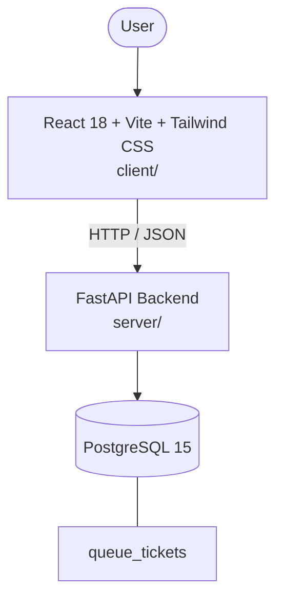

# Architecture

_Auto-generated by the SDLC Assistant from the generated codebase and the approved Feature Spec (latest: SCRUM-103). Regenerated on each push._

## System Diagram

## Tech Stack
- **language**: Python 3.11
- **backend_framework**: FastAPI
- **orm**: SQLAlchemy 2.x
- **database**: PostgreSQL 15
- **frontend**: React 18 + Vite + Tailwind CSS
- **cloud_provider**: GCP (Cloud Run & Cloud SQL)
- **constitution_section_4_followed**: True

## Backend Modules (server/)
- server/__init__.py
- server/api/__init__.py
- server/api/v1/__init__.py
- server/api/v1/queue.py
- server/database.py
- server/main.py
- server/models/__init__.py
- server/models/queue.py
- server/repositories/__init__.py
- server/repositories/queue_repository.py
- server/schemas/__init__.py
- server/schemas/queue.py
- server/services/__init__.py
- server/services/queue_service.py
- server/tests/__init__.py
- server/tests/conftest.py
- server/tests/test_queue_api.py

## Frontend Modules (client/)
- (no client/ files found yet)

## API Endpoints
- POST /api/v1/queue/tickets
- GET /api/v1/queue/tickets/{ticket_id}
- GET /api/v1/queue/tickets
- PATCH /api/v1/queue/tickets/{ticket_id}/status

## Data Model
- queue_tickets
