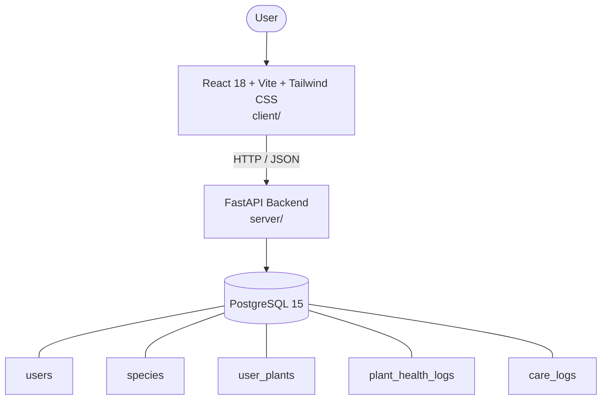

# Architecture

_Auto-generated by the SDLC Assistant from the generated codebase and the approved Feature Spec (latest: SCRUM-242). Regenerated on each push._

## System Diagram

## Tech Stack
- **language**: Python 3.11
- **backend_framework**: FastAPI 0.109+
- **orm**: SQLAlchemy 2.x
- **database**: PostgreSQL 15
- **frontend**: React 18 + Vite + Tailwind CSS
- **cloud_provider**: GCP (Cloud Run & Cloud SQL)
- **constitution_section_4_followed**: True

## Backend Modules (server/)
- server/__init__.py
- server/database.py
- server/main.py
- server/middleware/__init__.py
- server/middleware/auth.py
- server/models.py
- server/routers/__init__.py
- server/routers/auth.py
- server/routers/health_logs.py
- server/routers/plants.py
- server/routers/schedules.py
- server/routers/species.py
- server/schemas.py
- server/tests/__init__.py
- server/tests/conftest.py
- server/tests/test_auth.py
- server/tests/test_health_logs.py
- server/tests/test_plants.py
- server/tests/test_schedules.py
- server/tests/test_species.py

## Frontend Modules (client/)
- client/eslint.config.js
- client/postcss.config.js
- client/src/App.jsx
- client/src/App.test.jsx
- client/src/components/dashboard/ScheduleTable.jsx
- client/src/components/dashboard/StatCard.jsx
- client/src/components/dashboard/WateringAlertCard.jsx
- client/src/components/garden/AddPlantModal.jsx
- client/src/components/garden/PlantCard.jsx
- client/src/components/layout/Navbar.jsx
- client/src/components/species/AddCustomSpeciesModal.jsx
- client/src/components/species/SpeciesCard.jsx
- client/src/main.jsx
- client/src/pages/DashboardPage.jsx
- client/src/pages/GardenPage.jsx
- client/src/pages/SpeciesCatalogPage.jsx
- client/src/services/api.js
- client/src/setup.js
- client/tailwind.config.js
- client/vite.config.js

## API Endpoints
- POST /api/v1/auth/register
- POST /api/v1/auth/login
- GET /api/v1/species
- POST /api/v1/species
- GET /api/v1/plants
- POST /api/v1/plants
- POST /api/v1/plants/{plant_id}/water
- POST /api/v1/plants/{plant_id}/fertilize
- GET /api/v1/schedules
- POST /api/v1/health-logs

## Data Model
- users
- species
- user_plants
- plant_health_logs
- care_logs
