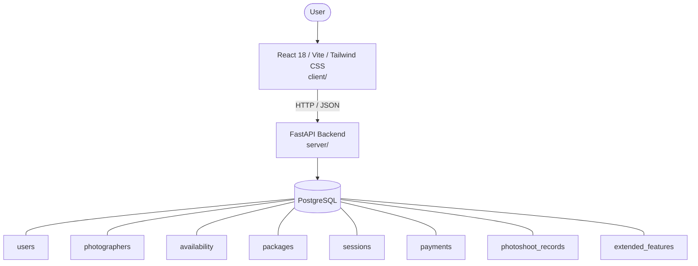

# Architecture

_Auto-generated by the SDLC Assistant from the generated codebase and the approved Feature Spec (latest: SCRUM-213). Regenerated on each push._

## System Diagram

## Tech Stack
- **language**: Python 3.11
- **backend_framework**: FastAPI
- **orm**: SQLAlchemy 2.x
- **database**: PostgreSQL
- **frontend**: React 18 / Vite / Tailwind CSS
- **cloud_provider**: Google Cloud Platform (GCP)
- **constitution_section_4_followed**: True

## Backend Modules (server/)
- server/__init__.py
- server/auth.py
- server/crud.py
- server/database.py
- server/main.py
- server/models.py
- server/routers/__init__.py
- server/routers/auth.py
- server/routers/dashboard.py
- server/routers/features.py
- server/routers/packages.py
- server/routers/payments.py
- server/routers/photographers.py
- server/routers/photoshoots.py
- server/routers/sessions.py
- server/schemas.py
- server/tests/__init__.py
- server/tests/conftest.py
- server/tests/test_auth.py
- server/tests/test_dashboard.py
- server/tests/test_features.py
- server/tests/test_packages.py
- server/tests/test_payments.py
- server/tests/test_photographers.py
- server/tests/test_photoshoots.py
- server/tests/test_sessions.py

## Frontend Modules (client/)
- client/eslint.config.js
- client/postcss.config.js
- client/src/App.jsx
- client/src/components/admin/PaymentLedgerTable.jsx
- client/src/components/booking/AddonCheckboxGroup.jsx
- client/src/components/booking/DepositPaymentForm.jsx
- client/src/components/booking/PackageSelector.jsx
- client/src/components/common/HoldBanner.jsx
- client/src/components/common/Navbar.jsx
- client/src/components/photographer/ConflictAlertModal.jsx
- client/src/components/photographer/WeeklyCalendarGrid.jsx
- client/src/components/sessions/PhotoshootCompletionModal.jsx
- client/src/main.jsx
- client/src/pages/AdminPackageLedgerPage.jsx
- client/src/pages/CustomerBookingPage.jsx
- client/src/pages/PhotographerAvailabilityPage.jsx
- client/src/pages/SessionTrackerPage.jsx
- client/src/services/api.js
- client/src/setup.js
- client/src/test/App.test.jsx
- client/tailwind.config.js
- client/vite.config.js

## API Endpoints
- POST /api/v1/auth/signup
- POST /api/v1/auth/login
- GET /api/v1/photographers
- GET /api/v1/photographers/{id}/slots
- POST /api/v1/photographers/{id}/availability
- GET /api/v1/packages
- POST /api/v1/sessions
- POST /api/v1/payments
- POST /api/v1/sessions/{id}/photoshoot-record
- GET /api/v1/features
- POST /api/v1/features

## Data Model
- users
- photographers
- availability
- packages
- sessions
- payments
- photoshoot_records
- extended_features
